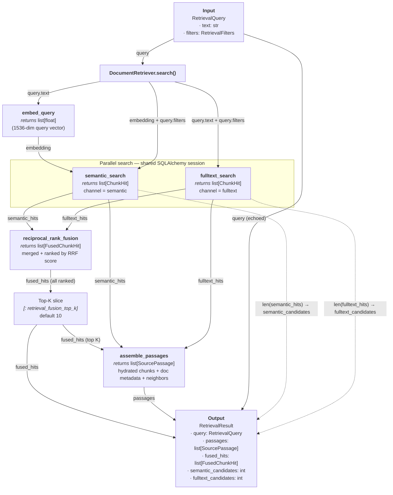

# Retrieval

Hybrid document retrieval for the document-copilot backend. This package searches indexed SEC filing chunks using **semantic** (vector) and **full-text** (PostgreSQL `tsvector`) channels, fuses the ranked results with **Reciprocal Rank Fusion (RRF)**, and assembles rich **source passages** (including neighboring chunks) for downstream chat, grounding, and citation flows.

## Architecture



**Edge key:** solid arrows = data passed into the next function; dotted arrows = derived counts bundled into the final result.

| Step | Receives | Returns | Passed to |
|------|----------|---------|-----------|
| `embed_query` | `query.text` | `list[float]` embedding | `semantic_search` |
| `semantic_search` | `session`, embedding, `query.filters`, `top_k` | `list[ChunkHit]` (`semantic_hits`) | `reciprocal_rank_fusion`, `assemble_passages`, `RetrievalResult.semantic_candidates` |
| `fulltext_search` | `session`, `query.text`, `query.filters`, `top_k` | `list[ChunkHit]` (`fulltext_hits`) | `reciprocal_rank_fusion`, `assemble_passages`, `RetrievalResult.fulltext_candidates` |
| `reciprocal_rank_fusion` | `[semantic_hits, fulltext_hits]`, `k` | `list[FusedChunkHit]` (sorted) | top-K slice |
| top-K slice | fused list | `fused_hits` (max 10) | `assemble_passages`, `RetrievalResult.fused_hits` |
| `assemble_passages` | `fused_hits`, `semantic_hits`, `fulltext_hits`, `neighbor_window` | `list[SourcePassage]` | `RetrievalResult.passages` |

**Intermediate types:**

- **`ChunkHit`** — `chunk_id`, `stable_chunk_id`, `document_id`, `rank`, `score`, `channel`
- **`FusedChunkHit`** — `chunk_id`, `stable_chunk_id`, `fused_score`, `semantic_rank?`, `fulltext_rank?`
- **`SourcePassage`** — full chunk text, `DocumentSummary`, `NeighborChunk` list, `fused_score`, matched `channels`

### Pipeline overview

1. **Embed** — The query string is converted to a vector via OpenAI embeddings (reusing the ingest embedding stack).
2. **Search (parallel channels)** — Two independent SQL queries run against `document_chunks` (joined to `source_documents` for metadata filters):
   - **Semantic**: pgvector cosine distance (`<=>`) on `dc.embedding`.
   - **Full-text**: `ts_rank_cd` over `dc.search_vector` with `websearch_to_tsquery('english', ...)`.
3. **Fuse** — RRF merges the two ranked lists into a single score per chunk, preserving per-channel ranks for tie-breaking.
4. **Assemble** — Top fused chunks are hydrated from the database with document metadata, chunk text, and optional neighbor chunks for broader context.
5. **Return** — A `RetrievalResult` bundles passages, fused hits, and candidate counts for observability.

### Consumers

`DocumentRetriever` is the public entry point. It is wired into:

- `app/api/chat.py` — FastAPI dependency injection for chat endpoints
- `app/chat/orchestrator.py` and `app/chat/streaming.py` — chat message flow
- `app/assistant/deps.py` and `app/assistant/agent.py` — assistant tooling
- `backend/scripts/smoke_retrieval.py` — manual smoke tests against the live corpus

Downstream modules (`app/grounding/validator.py`, `app/chat/messages.py`, `app/assistant/outputs.py`) consume `SourcePassage` and related schemas for citations and grounding validation.

---

## Module reference

### `retriever.py` — orchestration

**`DocumentRetriever`** is the façade that runs the full pipeline.

| Method | Description |
|--------|-------------|
| `search(query: RetrievalQuery) -> RetrievalResult` | Embeds the query, runs both search channels, fuses results, assembles passages |

Constructor dependencies (all optional, with sensible defaults):

- `session_factory` — SQLAlchemy session context manager (default: `session_scope`)
- `app_settings` — `Settings` instance for retrieval tuning knobs
- `openai_client` — shared OpenAI client for query embedding

### `embed.py` — query embedding

**`embed_query(text, *, client=None) -> list[float]`**

Thin wrapper around `ingest.embeddings.embed_texts`. Embeds a single query string using the same model and batching logic as document ingestion, keeping query and corpus vectors comparable.

### `queries.py` — database search

Runs parameterized raw SQL via SQLAlchemy against Postgres/Supabase.

| Function | Channel | SQL technique |
|----------|---------|---------------|
| `semantic_search(session, embedding, filters, *, top_k)` | `RetrievalChannel.SEMANTIC` | `1 - (embedding <=> query_vector)` ordered ascending by distance |
| `fulltext_search(session, query_text, filters, *, top_k)` | `RetrievalChannel.FULLTEXT` | `ts_rank_cd(search_vector, websearch_to_tsquery(...))` |

**Helpers (internal):**

- `_build_filter_sql(filters)` — optional `AND` clauses for `tickers`, `fiscal_years`, and `filing_types` on `source_documents`
- `_format_embedding(embedding)` — formats a float list as a pgvector literal string
- `_rows_to_hits(rows, *, channel)` — maps SQL rows to ranked `ChunkHit` objects

Both searches require chunks with non-null embeddings (semantic) or a matching `search_vector` (full-text), and honor the same `RetrievalFilters`.

### `fusion.py` — rank fusion

**`reciprocal_rank_fusion(rankings, *, k=60) -> list[FusedChunkHit]`**

Implements **Reciprocal Rank Fusion**. For each chunk appearing in any input ranking:

```
fused_score += 1 / (k + rank)
```

Chunks are keyed by `stable_chunk_id` (stable across re-ingestion). The function records `semantic_rank` and `fulltext_rank` when present, then sorts by:

1. Descending `fused_score`
2. Ascending `semantic_rank` (missing ranks sort last)
3. Ascending `fulltext_rank` (missing ranks sort last)

The internal `_FusionAccumulator` dataclass accumulates scores during fusion.

### `assembly.py` — passage hydration

**`assemble_passages(session, fused_hits, semantic_hits, fulltext_hits, *, neighbor_window) -> list[SourcePassage]`**

Turns fused chunk IDs into fully populated passages:

1. Batch-fetch chunk rows (`fetch_chunks_by_ids`)
2. Batch-fetch parent documents (`fetch_documents_by_ids`)
3. Build a per-chunk channel map (`_channel_map`) from the original semantic/full-text hit lists
4. For each fused hit, fetch neighbor chunks within `neighbor_window` of the hit's `chunk_index` (`fetch_neighbor_chunks`)
5. Emit `SourcePassage` objects with document summary, chunk text, metadata, neighbors, fused score, and matched channels

Chunks or documents missing from the database are skipped silently.

### `schemas.py` — Pydantic models

All request/response and intermediate types for the retrieval layer.

| Model | Role |
|-------|------|
| `RetrievalChannel` | Enum: `semantic`, `fulltext` |
| `RetrievalFilters` | Optional filters: `tickers`, `fiscal_years`, `filing_types` |
| `RetrievalQuery` | Input: `text` (required) + `filters` |
| `ChunkHit` | Single ranked result from one search channel |
| `FusedChunkHit` | Post-RRF chunk with `fused_score` and optional channel ranks |
| `DocumentSummary` | Lightweight document metadata for citations |
| `NeighborChunk` | Adjacent chunk text with `position` (`before` / `after`) |
| `SourcePassage` | Final hydrated passage passed to chat/grounding |
| `RetrievalResult` | Complete search output with passages, fused hits, and candidate counts |

### `__init__.py` — public exports

Re-exports the types and `DocumentRetriever` listed in `__all__` for convenient `from app.retrieval import ...` imports.

---

## Configuration

Retrieval behavior is tuned via `Settings` in `app/config.py`:

| Setting | Default | Used by |
|---------|---------|---------|
| `retrieval_semantic_top_k` | `50` | `semantic_search` limit |
| `retrieval_fulltext_top_k` | `50` | `fulltext_search` limit |
| `retrieval_fusion_top_k` | `10` | Slice after RRF — max fused hits kept |
| `retrieval_rrf_k` | `60` | RRF constant `k` in `1/(k + rank)` |
| `retrieval_neighbor_window` | `1` | Chunks before/after each hit to include |

---

## Usage

```python
from app.retrieval import DocumentRetriever, RetrievalQuery, RetrievalFilters

retriever = DocumentRetriever()

result = retriever.search(
    RetrievalQuery(
        text="AWS operating margin",
        filters=RetrievalFilters(
            tickers=["AMZN"],
            fiscal_years=[2024],
        ),
    )
)

for passage in result.passages:
    print(passage.document.ticker, passage.fused_score, passage.chunk_text[:200])
```

Manual smoke test against the live corpus:

```bash
cd backend
python -m scripts.smoke_retrieval
```

---

## Database dependencies

Retrieval assumes the ingest pipeline has populated:

| Table / column | Used for |
|----------------|----------|
| `document_chunks.embedding` | Semantic vector search (pgvector) |
| `document_chunks.search_vector` | Full-text search (`tsvector`) |
| `document_chunks.stable_chunk_id` | Cross-channel identity and fusion |
| `document_chunks.chunk_index` | Neighbor window lookup |
| `source_documents` | Ticker, fiscal year, filing type filters and document metadata |

Assembly delegates chunk/document fetches to `app.database.documents`.

---

## File map

```
retrieval/
├── __init__.py      Public exports
├── retriever.py     DocumentRetriever orchestrator
├── embed.py         Query → embedding vector
├── queries.py       Semantic and full-text SQL search
├── fusion.py        Reciprocal Rank Fusion
├── assembly.py      Hydrate fused hits into SourcePassage
├── schemas.py       Pydantic models
└── README.md        This file
```
