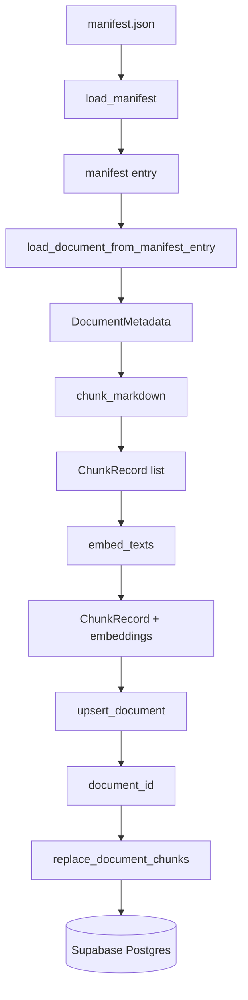

# Ingest

Offline corpus ingestion for the document-copilot backend. This package reads SEC filings from a local **manifest** and converted **Markdown** files, splits them into searchable chunks, embeds them with OpenAI, and persists everything to Supabase (`source_documents` + `document_chunks`).

Ingest is the upstream counterpart to `app/retrieval/`: chunks written here supply the embeddings and text that hybrid retrieval searches at query time.

## Architecture



### Pipeline overview

1. **Load manifest** — Read `data/downloads/manifest.json` and optionally filter by ticker.
2. **Resolve document** — For each filing entry, locate the matching `.md` file under `data/markdown/`, read its content, and build a `DocumentMetadata` record (ticker, company, fiscal year, accession number, source URL).
3. **Chunk** — Split Markdown into section-aware, token-bounded `ChunkRecord` objects with stable IDs and metadata.
4. **Embed** — Batch-embed chunk text via OpenAI (`text-embedding-3-small` by default), attaching vectors to each chunk.
5. **Persist** — Upsert the parent document by `accession_number`, delete existing chunks for that document, and insert the new chunk rows (with retries for transient failures).
6. **Summarize** — Return counts of documents processed, chunks written, and embeddings created.

The pipeline is **idempotent**: re-running ingest for the same accession overwrites the document row and fully replaces its chunks.

### Prerequisites (outside this package)

Ingest assumes Markdown already exists. Conversion is a separate step:

```powershell
cd backend
uv run python ../data/convert_to_markdown.py
```

That script (Docling-based) produces `.md` files from downloaded HTML under `data/downloads/`. See `INGESTION_ISSUES.md` for conversion pitfalls and operational notes from production runs.

---

## Module reference

### `run.py` — CLI orchestrator

Entry point for batch ingestion. Exposed as the `ingest-corpus` console script and runnable as `python -m ingest.run`.

| Symbol | Description |
|--------|-------------|
| `IngestSummary` | Dataclass tracking `documents_processed`, `documents_failed`, `chunks_written`, `embeddings_created` |
| `ingest_filing(...)` | Process a single manifest entry through chunk → embed → persist |
| `run_ingest(...)` | Loop over manifest filings with optional ticker filter |
| `main()` | argparse CLI |

**`ingest_filing` flow:**

1. `load_document_from_manifest_entry` → `DocumentMetadata`
2. `chunk_markdown` → list of `ChunkRecord`
3. If `dry_run`: log chunk count and return `(0, 0)`
4. `upsert_document` → UUID
5. If `documents_only`: return early (no chunks)
6. If not `skip_embeddings`: `embed_texts` on all chunk texts, attach to records
7. `replace_document_chunks` → write count

**CLI flags:**

| Flag | Effect |
|------|--------|
| `--manifest` | Path to manifest JSON (default: `data/downloads/manifest.json`) |
| `--downloads-root` | Root of downloaded HTML (default: `data/downloads`) |
| `--markdown-root` | Root of converted Markdown (default: `data/markdown`) |
| `--ticker` | Ingest only one ticker (e.g. `AAPL`) |
| `--dry-run` | Parse and chunk only; no Supabase or OpenAI calls |
| `--documents-only` | Upsert `source_documents` only; skip chunks and embeddings |
| `--skip-embeddings` | Write chunks without vectors (debug persist path only) |

Default paths are resolved relative to the repo root (`REPO_ROOT = parents[2]` from `run.py`).

### `metadata.py` — manifest and document loading

Bridges the download manifest and on-disk Markdown into `DocumentMetadata`.

| Function | Description |
|----------|-------------|
| `load_manifest(path)` | Parse `manifest.json` |
| `markdown_path_for(entry, ...)` | Map manifest `local_path` to `.md` under `markdown_root` |
| `fiscal_year_from_manifest(entry)` | Derive fiscal year from `report_date` or `filing_date` (first 4 chars) |
| `company_name_for_ticker(ticker)` | Look up display name from `COMPANY_NAMES` (AAPL, MSFT, NVDA, AMZN, GOOGL) |
| `build_document_metadata(entry, markdown, markdown_path)` | Construct `DocumentMetadata`; rejects empty Markdown |
| `load_document_from_manifest_entry(entry, ...)` | Read `.md` file and return full metadata |

Raises `FileNotFoundError` with a hint to run `convert_to_markdown.py` when the Markdown file is missing.

### `models.py` — in-memory data structures

| Dataclass | Fields | Role |
|-----------|--------|------|
| `DocumentMetadata` | `ticker`, `company_name`, `filing_type`, `fiscal_year`, `accession_number`, `source_url`, `markdown_content`, `markdown_path` | One SEC filing ready for chunking |
| `ChunkRecord` | `stable_chunk_id`, `chunk_index`, `chunk_text`, `section_label`, `page_label`, `token_count`, `chunk_metadata`, `embedding` | One searchable text segment; `embedding` set after `embed_texts` |

`DocumentMetadata` is frozen; `ChunkRecord` is mutable so embeddings can be attached in place.

### `chunking.py` — Markdown → chunks

**`chunk_markdown(metadata, markdown) -> list[ChunkRecord]`**

Splits a filing into retrieval-ready segments.

**Constants:**

| Constant | Value | Purpose |
|----------|------:|---------|
| `MAX_CHUNK_TOKENS` | 800 | Upper bound per chunk |
| `OVERLAP_TOKENS` | 100 | Overlap when splitting long sections |
| `MIN_CHUNK_TOKENS` | 50 | Chunks below this are dropped |
| `MAX_SECTION_LABEL_LENGTH` | 255 | Matches DB `varchar(255)` on `section_label` |

**Steps:**

1. **`_split_into_sections`** — Detect section boundaries via `SECTION_HEADING_RE` (Markdown `#` headings or `Item N.` SEC-style headings). Text before the first heading becomes an unlabeled preamble section.
2. **`_split_long_section`** — Sections exceeding `MAX_CHUNK_TOKENS` are split on paragraph breaks (`\n\n`) with `OVERLAP_TOKENS` character overlap (tokens estimated as `len(text) // 4`).
3. **Filter** — Skip pieces under `MIN_CHUNK_TOKENS`.
4. **Build records** — Assign `stable_chunk_id` as `{accession_number}:{chunk_index}`, normalize section labels (`_normalize_section_label` truncates to 255 chars), and populate `chunk_metadata` (ticker, company, filing info, `char_start`/`char_end`, `content_hash`).

**Helpers:**

| Function | Description |
|----------|-------------|
| `estimate_tokens(text)` | Rough token count: `max(1, len(text) // 4)` |
| `_content_hash(text)` | SHA-256 prefix (16 hex chars) for dedup/debug |
| `_normalize_section_label(label)` | Strip, truncate long labels (Docling artifacts on large 10-Ks) |

### `embeddings.py` — OpenAI vector generation

**`embed_texts(texts, *, batch_size=64, client=None) -> list[list[float]]`**

Batch-embeds a list of strings using the configured OpenAI embedding model. Also used by `app/retrieval/embed.py` for query vectors, keeping corpus and query embeddings aligned.

| Setting | Default | Source |
|---------|---------|--------|
| Model | `text-embedding-3-small` | `settings.openai_embedding_model` |
| Dimensions | `1536` | `settings.openai_embedding_dimensions` |
| Batch size | `64` | `DEFAULT_BATCH_SIZE` |
| Retries | `5` with exponential backoff | On `RateLimitError` only |

Returns embeddings in input order. Empty input returns `[]`.

### `persist.py` — Supabase writes

Writes documents and chunks via the Supabase Python client with retry logic for transient HTTP/SSL failures.

| Function | Description |
|----------|-------------|
| `upsert_document(client, metadata)` | Insert or update `source_documents` keyed by `accession_number`; returns `document_id` |
| `replace_document_chunks(client, document_id, chunks)` | Delete all existing chunks for the document, then batch-insert new rows |
| `_execute_with_retry(operation)` | Up to 5 attempts with exponential backoff on any exception |
| `_chunk_row(document_id, chunk)` | Map `ChunkRecord` to insert payload |

**Persist behavior:**

- Documents: lookup by `accession_number`; update if exists, insert with new UUID if not. Full `markdown_content` is stored on the document row.
- Chunks: **replace semantics** — delete all chunks for `document_id`, then insert fresh rows. Each chunk gets a new random UUID; identity across re-ingests is `stable_chunk_id`.
- Batch size: `CHUNK_BATCH_SIZE = 25` (reduced from 50 to avoid PostgREST disconnects on large embedding payloads).
- Embeddings: included in the row only when `chunk.embedding is not None`.

**Note:** `search_vector` on `document_chunks` is a Postgres **generated column** (`to_tsvector('english', chunk_text)`). Ingest does not set it; it is populated automatically when `chunk_text` is inserted.

### `__init__.py` — package docstring

Declares the package purpose: `Offline corpus ingestion: Markdown → chunk → embed → Supabase.`

---

## Configuration

Embedding settings live in `app/config.py` (read by `embeddings.py`):

| Setting | Default |
|---------|---------|
| `openai_api_key` | from environment |
| `openai_embedding_model` | `text-embedding-3-small` |
| `openai_embedding_dimensions` | `1536` |

Supabase access uses `get_service_role_client()` from `app.database.supabase` (service-role key required for writes).

---

## Usage

Full corpus ingest:

```powershell
cd backend
uv run python -m ingest.run
```

Or via the console script:

```powershell
uv run ingest-corpus
```

Common variants:

```powershell
# Preview chunk counts without API calls
uv run ingest-corpus --dry-run

# Re-ingest one ticker after a partial failure
uv run python -m ingest.run --ticker GOOGL

# Upsert documents only (no chunks/embeddings)
uv run python -m ingest.run --documents-only

# Test persist path without OpenAI
uv run python -m ingest.run --skip-embeddings
```

---

## Database targets

| Table | Written by | Key columns |
|-------|------------|-------------|
| `source_documents` | `upsert_document` | `ticker`, `company_name`, `filing_type`, `fiscal_year`, `accession_number`, `source_url`, `markdown_content` |
| `document_chunks` | `replace_document_chunks` | `stable_chunk_id`, `chunk_index`, `chunk_text`, `section_label`, `token_count`, `chunk_metadata`, `embedding` |

Indexes (from Alembic migration) used downstream by retrieval:

- HNSW on `embedding` (semantic search)
- GIN on `search_vector` (full-text search, auto-generated from `chunk_text`)
- GIN on `chunk_metadata`

---

## Downstream consumers

| Consumer | What it uses |
|----------|--------------|
| `app/retrieval/embed.py` | `embed_texts` — same embedding model for query vectors |
| `app/retrieval/queries.py` | Reads `document_chunks` + `source_documents` written by ingest |

---

## Tests

Unit tests live in `tests/corpus_ingest/` (not `tests/ingest/` — that path shadows the package):

- `test_chunking.py` — section splitting, token limits, stable IDs
- `test_metadata.py` — manifest parsing, fiscal year, company names

---

## Verified corpus snapshot

From production ingest (see `INGESTION_ISSUES.md` for full operational log):

| Metric | Value |
|--------|------:|
| `source_documents` | 25 (5 tickers × 5 fiscal years) |
| `document_chunks` | 7,470 |
| Chunks with embeddings | 7,470 (100%) |
| Tickers | AAPL, MSFT, NVDA, AMZN, GOOGL |

---

## File map

```
ingest/
├── __init__.py        Package docstring
├── run.py             CLI orchestrator (ingest_filing, run_ingest, main)
├── metadata.py        Manifest → DocumentMetadata loading
├── models.py          DocumentMetadata, ChunkRecord dataclasses
├── chunking.py        Markdown section split + token-bounded chunks
├── embeddings.py      OpenAI batch embedding with retries
├── persist.py         Supabase upsert/replace with retries
├── INGESTION_ISSUES.md  Operational issues log (fixes, failure signals)
└── README.md          This file
```
