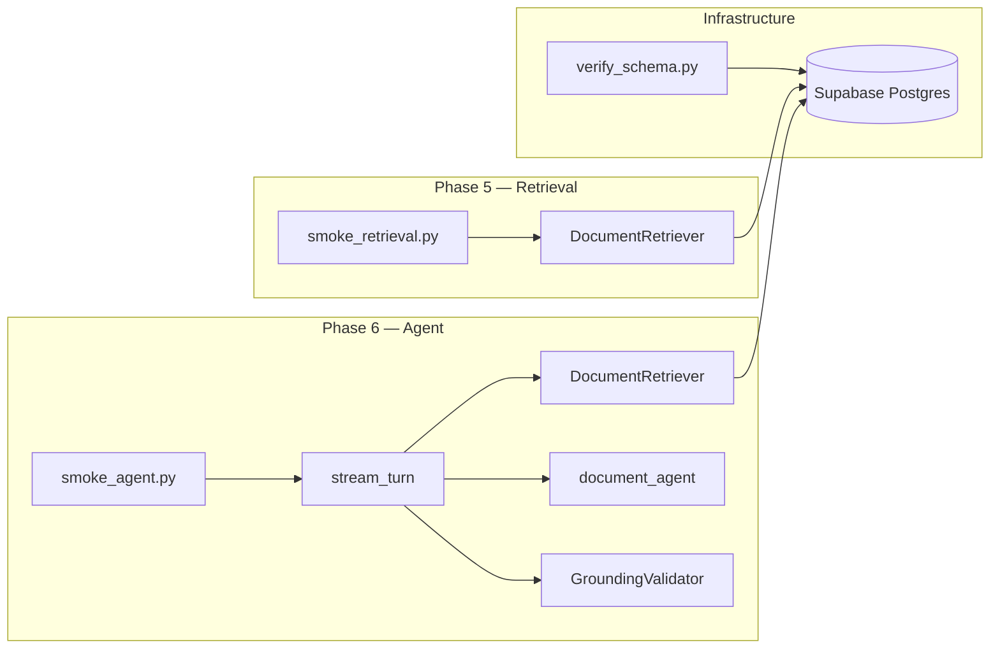

# Scripts

Manual operational scripts for the document-copilot backend. These are **not** part of the FastAPI application runtime — they are run from the shell to verify infrastructure, smoke-test retrieval against the live corpus, and exercise the grounded agent end-to-end.

All scripts assume you are in the `backend/` directory with a configured `.env` (Supabase `DATABASE_URL`, OpenAI API key, etc.).

## Architecture



### When to run what

| Script | Phase | Purpose | Requires live corpus |
|--------|-------|---------|----------------------|
| `verify_schema.py` | 1 | Confirm DB schema after Alembic migration | No |
| `smoke_retrieval.py` | 5 | Regression check for hybrid retrieval | Yes |
| `smoke_agent.py` | 6 | End-to-end grounded Q&A with citations | Yes |

Recommended order after setup:

1. `verify_schema.py` — schema is correct
2. Ingest corpus (`uv run ingest-corpus`) — data is loaded
3. `smoke_retrieval.py` — retrieval returns passages
4. `smoke_agent.py` — agent answers with citations or honest refusal

---

## Module reference

### `verify_schema.py` — database schema check

**One-off verification** against the linked Supabase database. Run after `uv run alembic upgrade head` to confirm migrations applied correctly.

**`main()` checks:**

| Check | What it verifies |
|-------|------------------|
| Expected tables | `users`, `source_documents`, `document_chunks`, `chat_threads`, `chat_messages`, `message_citations` |
| `vector` extension | pgvector installed (`select extname from pg_extension`) |
| `document_chunks` columns | `embedding` and `search_vector` present |
| Indexes | All `document_chunks_*` indexes (HNSW on embeddings, GIN on `search_vector`, etc.) |
| RLS | Row-level security status on each expected public table |

Uses SQLAlchemy `inspect` plus raw SQL via `settings.database_url` (normalized to `postgresql+psycopg://`). Prints results to stdout; does not exit with a non-zero code on failure — inspect output manually.

**Run:**

```powershell
cd backend
uv run python scripts/verify_schema.py
```

**Example output:**

```
tables missing: none
vector extension: vector
document_chunks columns: ['embedding', 'search_vector']
document_chunks indexes: ['document_chunks_embedding_hnsw_idx', ...]
rls enabled: [('chat_messages', True), ...]
```

---

### `smoke_retrieval.py` — hybrid retrieval smoke test

**Manual smoke test** for the retrieval pipeline against the live Supabase corpus. Exercises `DocumentRetriever.search()` with fixed queries drawn from the client brief and phase-five todos.

**Flow:**

1. Instantiate `DocumentRetriever`
2. For each query in `SMOKE_QUERIES`, run `RetrievalQuery(text=query_text)`
3. Print candidate counts: semantic, fulltext, fused, passages
4. Print top 3 passages with ticker, fiscal year, fused score, channels, and text preview

**`SMOKE_QUERIES`:**

| Query | Intent |
|-------|--------|
| `AWS operating margin` | Amazon/AWS financial metrics |
| `NVIDIA data center demand` | NVDA segment demand |
| `Azure AI infrastructure capacity` | Microsoft cloud/AI capacity |
| `Apple Services revenue mix` | AAPL Services segment |
| `generative AI improved margins` | Negative control — may return no passages (allowed) |

**Exit codes:**

- `0` — all queries except the negative control returned passages
- `1` — one or more non-control queries returned empty results

**Run:**

```powershell
cd backend
uv run python scripts/smoke_retrieval.py
```

**Dependencies:** `app.retrieval.retriever`, `app.retrieval.schemas`

---

### `smoke_agent.py` — grounded agent smoke test

**End-to-end smoke test** for the chat orchestrator and grounded agent. Runs real retrieval, LLM generation, and grounding validation against the live corpus — no HTTP server required.

**Flow:**

1. For each query in `SMOKE_QUERIES`, call `stream_turn()` from `app.chat.orchestrator`
2. Collect streamed text deltas and the final `TurnResult`
3. Print validation status, `insufficient_evidence` flag, citation count, and answer preview
4. Count failures (missing turn result or raised exception)

**Wiring inside `_run_query`:**

| Component | Role |
|-----------|------|
| `DocumentRetriever` | Hybrid search for the user question |
| `GroundingValidator` | Validates citations against retrieved passages |
| `stream_turn` | Orchestrates retrieval → agent → validation → `TurnResult` |
| Ephemeral `thread_id` / `user_id="smoke-user"` | Synthetic session (not persisted to chat tables) |

**`SMOKE_QUERIES`:**

| Query | Expected behavior |
|-------|-------------------|
| `For Amazon, what did the filing say about AWS operating margin?` | Cited answer from AMZN filings |
| `How did NVIDIA describe Data Center demand drivers?` | Cited answer from NVDA filings |
| `Do the filings prove that generative AI improved margins for any company?` | Honest refusal (`insufficient_evidence`) |

**Exit codes:**

- `0` — all three queries completed without error
- `1` — one or more queries failed or returned no turn result

**Run:**

```powershell
cd backend
uv run python scripts/smoke_agent.py
```

**Dependencies:** `app.chat.orchestrator`, `app.grounding.validator`, `app.retrieval.retriever`

**Requires:** Valid `OPENAI_API_KEY` in addition to Supabase access (agent calls the LLM).

---

## Prerequisites

| Requirement | Scripts affected |
|-------------|------------------|
| `backend/.env` with `DATABASE_URL` (direct Supabase host) | All |
| Alembic migration applied | `verify_schema.py`, smoke scripts |
| Corpus ingested (`uv run ingest-corpus`) | `smoke_retrieval.py`, `smoke_agent.py` |
| `OPENAI_API_KEY` | `smoke_agent.py` |

`DATABASE_URL` must use Supabase's **direct** connection (`db.<ref>.supabase.co`), not the pooler. See [backend/README.md](../README.md).

---

## Relationship to automated tests

| Script | pytest counterpart |
|--------|-------------------|
| `verify_schema.py` | No direct unit test — manual infra check |
| `smoke_retrieval.py` | `tests/retrieval/` (mocked DB; no live corpus) |
| `smoke_agent.py` | `tests/chat/test_orchestrator.py` (mocked agent) |

Smoke scripts complement pytest: they hit the **live** database and (for the agent) OpenAI, catching integration issues unit tests cannot.

---

## Quick reference

```powershell
cd backend

# After migration
uv run python scripts/verify_schema.py

# After ingest — retrieval regression
uv run python scripts/smoke_retrieval.py

# Full agent path — retrieval + LLM + grounding
uv run python scripts/smoke_agent.py
```

---

## File map

```
scripts/
├── verify_schema.py     Post-migration DB schema verification
├── smoke_retrieval.py   Live hybrid retrieval smoke test
├── smoke_agent.py       Live grounded agent end-to-end smoke test
└── README.md            This file
```
