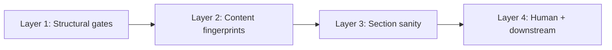
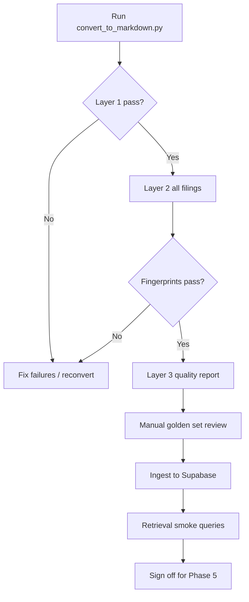

# Markdown conversion testing strategy

Validate that SEC filing HTML converted by Docling into `data/markdown/` is **fit for ingest and retrieval** — not a byte-for-byte HTML replica.

Related: [convert_to_markdown.py](convert_to_markdown.py) · [phase-four-implementation-plan.md](../implementation-plan/phase-four-implementation-plan.md) · [manifest.json](downloads/manifest.json) (local, gitignored)

---

## Purpose

Docling converts messy SEC 10-K HTML into Markdown for the Phase 4 ingestion pipeline. Before chunking, embedding, and upserting to Supabase, confirm that:

1. Every downloaded filing has a usable Markdown sibling.
2. Document identity and 10-K structure are preserved.
3. Narrative prose (Business, Risk Factors, MD&A) is readable and retrievable.
4. Known artifacts (empty table rows, duplicated cells, anchor hashes) do not block downstream use.

This document defines **what to test**, **when to run it**, and **pass/fail thresholds** — not implementation details.

---

## Definition of “correct”

Success is measured by downstream utility, not formatting perfection.

| Goal | Pass criteria |
|------|----------------|
| **Completeness** | Every manifest filing has a non-empty `.md` under `data/markdown/` with matching relative path |
| **Structure** | Standard 10-K sections appear (`Item 1`, `Item 1A`, `Item 7`, `Item 8`, etc.) |
| **Identity** | Ticker, company name, fiscal year, and accession-related text match `manifest.json` |
| **Retrieval value** | Known phrases from the filing appear in Markdown (MD&A, risk factors, revenue figures) |
| **Chunkability** | Enough continuous prose; file is not mostly empty tables or boilerplate |

**Not required for v1:**

- Perfect financial tables or TOC layout
- Removal of all XBRL noise
- Pixel or layout parity with SEC HTML viewer
- Clean internal anchor links (e.g. `#i7bfbfbe54b9647b1...`)

---

## Validation layers

Run checks from cheapest (structural) to most expensive (human + downstream). Each layer builds on the previous one.



### Layer 1 — Structural gates

**When:** After every `convert_to_markdown.py` run.  
**Blocks ingest:** Yes.

| Check | Description |
|-------|-------------|
| 1:1 mapping | Each `manifest.json` `local_path` → corresponding `.md` exists (`downloads/foo.htm` → `markdown/foo.md`) |
| Non-empty | File size above minimum threshold (e.g. 50 KB for a 10-K; flag outliers) |
| Encoding | Valid UTF-8; no decode errors |
| Basic stats | Line count, word count, ratio of heading lines vs plain text |
| Conversion failures | Zero entries in convert script failure summary |

These catch “conversion ran but produced nothing or garbage.”

### Layer 2 — Content fingerprints

**When:** After conversion batch, before ingest.  
**Blocks ingest:** Yes on hard failures (missing sections, ticker, fiscal year).

Use `manifest.json` as the oracle (`ticker`, `report_date`, `accession_number`, `filing_date`, `source_url`).

**Automated checks (all filings):**

| Field | Example assertion |
|-------|-------------------|
| Ticker | `AAPL` appears in Markdown |
| Company | `Apple Inc.` (or known alias) appears |
| Form | `FORM 10-K` or `Form 10-K` |
| Fiscal period | Report date from manifest appears (e.g. `September 28, 2024`) |
| Accession | Accession fragment or normalized filing identifier appears |
| Section markers | Regex match for `Item 1.`, `Item 1A.`, `Item 7.`, `Item 8.` |

**Optional cross-source check (stronger):**

1. Extract 5–10 anchor strings from raw HTML as plain text (not tags): first sentence of Item 1 Business, a distinctive risk-factor phrase, one revenue number from MD&A.
2. Assert each anchor appears in Markdown after normalization (case-insensitive, collapsed whitespace).

Compare **substring presence**, not full-document diff. Full diff will always fail on SEC filings.

### Layer 3 — Section sanity

**When:** After conversion batch or when Docling version changes.  
**Blocks ingest:** No — warnings only unless prose is effectively missing.

10-Ks have predictable anatomy. Per filing, verify:

| Section | What to verify |
|---------|----------------|
| Item 1 Business | Heading present; substantive prose after heading (> N words) |
| Item 1A Risk Factors | Heading present; at least one substantive paragraph |
| Item 7 MD&A | Heading present; mentions “Results of Operations” or equivalent |
| Item 8 Financials | Heading present (tables may be ugly — acceptable) |

**Quality metrics (warn, do not fail by default):**

| Signal | Typical Docling artifact |
|--------|--------------------------|
| High ratio of empty table rows | `\| \| \|` patterns |
| Repeated identical cell text | Duplicated column values in tables |
| Image placeholders | `<!-- image -->` |
| Internal anchor IDs | Hash suffixes in TOC links |

Flag a filing if empty-table lines exceed ~40% of total lines or word count falls below ~50% of the same-ticker prior year.

### Layer 4 — Human review and downstream proof

**When:** Once per golden set; after major Docling or conversion script changes; after first ingest.  
**Blocks ingest:** Yes for golden set only; downstream proof blocks Phase 5.

Automation cannot fully judge readability. Reserve human time for a small **golden set** and confirm retrieval works end-to-end.

---

## Golden set (manual review)

Review **5 filings** (~15 minutes each), side by side: SEC HTML in browser vs local `.md`.

| Filing | Why include |
|--------|-------------|
| AAPL 2024 | Representative “easy” filing |
| MSFT (largest / slowest convert) | Stress test size and runtime |
| AMZN or GOOGL | Table-heavy layout |
| One 2021 filing | Older HTML format |
| One 2025 filing | Most recent format |

**Manual checklist per filing:**

1. Open HTML via `source_url` from manifest and Markdown locally.
2. Jump to Item 1, 1A, and 7 — confirm narrative reads coherently.
3. Pick one financial number from MD&A — confirm it appears in Markdown.
4. Skim TOC / index — sections listed even if table formatting is poor.
5. Note artifacts for later cleanup; do not block v1 unless prose is missing.

---

## Downstream proof (post-ingest)

The strongest validation runs **after** chunk + embed (Phase 4 ingest). Fixed retrieval queries should return readable chunks with correct metadata:

| Query theme | Example |
|-------------|---------|
| Services revenue | “Apple services revenue fiscal 2024” |
| Segment demand | “NVIDIA data center revenue” |
| Cloud margins | “Amazon AWS operating margin” |

If hybrid search (Phase 5) returns sensible passages, conversion quality is **good enough** even with table noise.

---

## Testing lifecycle

| When | What | Owner | Blocks progress? |
|------|------|-------|------------------|
| After each conversion batch | Layer 1 (mapping, non-empty, failures) | Automated | Yes |
| Before ingest | Layer 2 fingerprints on all filings | Automated | Yes |
| Weekly or Docling version bump | Layer 3 metrics + diff vs prior report | Automated + review | Warn |
| Golden set / major parser change | Layer 4 manual side-by-side | Human | Yes (golden set) |
| After first ingest | Retrieval smoke queries | Automated + human | Yes (before Phase 5) |



### Re-run triggers

- New files added under `data/downloads/`
- Docling version change in `backend/pyproject.toml`
- Changes to `convert_to_markdown.py`
- Ingest chunking changes that expose conversion gaps

### Idempotency check

- Re-run conversion **without** `--force` → all files skipped (mtime check).
- Re-run **with** `--force` → Layer 2 fingerprints should match prior run (store hash of normalized text per filing for comparison).

---

## Blocking vs quality thresholds

Separate hard failures from warnings.

### Blocking (fail / do not ingest)

- Missing `.md` for a manifest entry
- Empty or trivially small file
- Missing Item 1, 7, or 8 headings
- Ticker or fiscal year not found in content
- Any per-file conversion exception

### Quality (warn only)

- Empty table row ratio > 30%
- Word count below expected percentile for ticker/year
- Many `<!-- image -->` placeholders
- Cross-year word count drop > 50% for same ticker

---

## Normalization for comparisons

When matching HTML text to Markdown:

1. Strip HTML tags from source → plain text baseline.
2. Collapse whitespace; lowercase for comparison.
3. Ignore minor punctuation differences.
4. Use **substring / anchor** tests, not full-document diff.

---

## Recommended artifacts (when implementing)

These are suggested deliverables for Phase 4 — not required to exist yet.

| Artifact | Purpose |
|----------|---------|
| `data/validate_markdown.py` | Layer 1 + 2 CLI; reads manifest + `data/markdown/` |
| `backend/tests/fixtures/markdown_anchors.json` | Small committable golden anchors (~3–5 strings per golden filing) |
| `backend/tests/data/test_markdown_validation.py` | Fast unit tests on anchors (no Docling in default suite) |
| Local validation report (JSON/CSV) | Per-run metrics; do not commit full `.md` corpus |

Example report row:

```text
ticker, accession, md_bytes, word_count, has_item_1, has_item_7, empty_table_ratio, warnings[]
```

Example anchor fixture shape:

```json
{
  "2024/aapl_10-k_2024-11-01_0000320193-24-000123.md": {
    "must_contain": [
      "Apple Inc.",
      "Item 7.",
      "September 28, 2024"
    ]
  }
}
```

Mark slow Docling smoke tests with `@pytest.mark.integration`.

---

## Cross-filing anomaly detection

Compare aggregate stats across the corpus (~25 filings):

- MSFT is typically largest; flag if another filing is an order of magnitude off.
- Flag same-ticker year-over-year word count drops > 50% (possible truncation).
- Flag filings where section headings exist but prose between headings is near zero.

---

## What to avoid

Do not invest v1 effort in:

- Pixel or layout comparison with SEC viewer
- Perfect financial table reconstruction
- Re-parsing XBRL from HTML inside the validation pipeline
- Committing full Markdown corpus to git (artifacts stay gitignored)

The chunker splits on headings and size; retrieval cares about **passage text**, not table structure.

---

## Run commands (reference)

Conversion (prerequisite):

```powershell
cd backend
uv run python ../data/convert_to_markdown.py
```

Future validation (when implemented):

```powershell
cd backend
uv run python ../data/validate_markdown.py
uv run pytest tests/data/test_markdown_validation.py
```

---

## Sign-off checklist

Before starting Phase 4 ingest on a new or refreshed corpus:

- [ ] Layer 1: all manifest entries have non-empty `.md` siblings
- [ ] Layer 2: fingerprints pass for all filings
- [ ] Layer 3: quality report reviewed; no filing dominated by empty tables
- [ ] Layer 4: golden set (5 filings) manually reviewed
- [ ] After ingest: sample chunks in Supabase contain readable SEC prose
- [ ] After Phase 5 wiring: fixed retrieval smoke queries return sensible results

**Success bar for v1:** every filing converts; key sections and metadata are present; MD&A and risk prose is readable; hybrid search returns usable chunks — not perfect Markdown.
