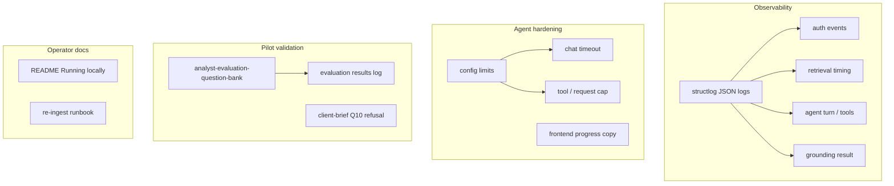

# Phase 8 — Pilot readiness & hardening

**Goal:** Make Document Copilot reliable, observable, and documented enough for a one-week analyst pilot — without deploying yet (that is Phase 9).

Related: [docs/todos.md](../docs/todos.md) · [docs/client-brief.md](../docs/client-brief.md) · [phase-seven-fix.md](phase-seven-fix.md) · [analyst-evaluation-question-bank.md](analyst-evaluation-question-bank.md) · [corpus-vs-openai.md](../docs/guides/general-questions/corpus-vs-openai.md)

**Prerequisite:** Phase 7 citation UI code complete; Phase 7 manual pass (MT-1/MT-2) green or issues logged.

---

## What Phase 8 delivers

| Outcome | Acceptance |
|---------|------------|
| Observable failures | Structured logs for auth, retrieval, agent, grounding, persistence |
| Predictable agent turns | Timeouts and tool/request limits wired from config |
| Trust validation | Client-brief + question-bank runs documented; refusal and citation stress cases pass |
| Operator docs | Root README “Running locally”, re-ingest runbook, links to guides |
| Deploy-ready frontend | `pnpm build` succeeds (TS config fix) |
| Better UX under load | Users see progress during long agent turns (not “frozen” UI) |

---

## Current state (gap analysis)

### Complete (Phases 0–7 code)

- Full stack: auth, corpus, hybrid retrieval, grounded agent, citation UI, response timer
- Grounding fixes: stable ID tolerance, table excerpt normalization, refusal citation strip
- **50** backend unit tests passing
- Docs: retrieval/ingest/scripts READMEs, question bank, `corpus-vs-openai` FAQ

### Gaps blocking pilot confidence

| Gap | Impact |
|-----|--------|
| `structlog` in deps but **stdlib logging only** in app | Hard to diagnose prod/pilot failures |
| `openai_chat_timeout_seconds` / `agent_max_tool_calls` **not wired** | Long hangs, `UsageLimitExceeded` on cross-company questions |
| Agent returns full answer **before** any SSE text | 15–120s “dots only” feels broken |
| `pnpm build` fails (TS5101 `baseUrl`) | Blocks Phase 9 static deploy |
| Root README “Running locally” stub | Onboarding friction |
| No re-ingest runbook | Operators cannot refresh corpus safely |
| Phase 7 manual pass unchecked | Citation UI not signed off in browser |
| No structured evaluation log | Pilot gaps unknown |

---

## Architecture (Phase 8 scope)



---

## Implementation checklist

### A — Close Phase 7 gate

- [ ] Complete manual pass MT-1 → MT-3 → MT-2 ([phase-seven-testing-plan.md](phase-seven-testing-plan.md))
- [ ] Tick Phase 7 manual item in `docs/todos.md`
- [ ] Log failures in [phase-seven-implementation-issues.md](phase-seven-implementation-issues.md) if any

### B — Structured logging (`structlog`)

- [ ] `app/logging.py` — configure structlog (JSON in prod-friendly format, console dev)
- [ ] Wire in `app/main.py` on startup
- [ ] Replace key `logging.getLogger` call sites with structured events:
  - `app/api/chat.py` — stream start/end, persistence errors
  - `app/chat/orchestrator.py` — retrieval ms, validation_failed, insufficient_evidence
  - `app/retrieval/retriever.py` — candidate counts (optional lightweight)
- [ ] Log fields: `thread_id`, `user_id`, `elapsed_ms`, `citation_count`, `validation_failed`, `error_type`

### C — Agent limits & timeouts

- [ ] Wire `openai_chat_timeout_seconds` into `OpenAIChatModel` / provider settings
- [ ] Wire `agent_max_tool_calls` (or PydanticAI `UsageLimits`) on `document_agent.run()`
- [ ] Add instructions line: prefer seed passages for single-ticker questions; limit redundant `search_filings` on cross-company compares
- [ ] Unit test or smoke note when limits exceeded → controlled error message (not blank stream)

### D — Long-turn UX (frontend)

- [ ] After 10s in `submitted`/`streaming`, show copy: “Searching filings and drafting answer…”
- [ ] Optional: distinguish “waiting for model” vs “streaming text” in `StreamingIndicator`
- [ ] Document expected wait times in question bank intro

### E — Pilot evaluation harness

- [ ] Create `implementation-plan/pilot-evaluation-log.md` (or `data/pilot-evaluation-results.md`) — table template
- [ ] Run **quick smoke** set from [analyst-evaluation-question-bank.md](analyst-evaluation-question-bank.md) (AMZN #2, NVDA #1, each #10, Cross #10)
- [ ] Run full **client-brief** example questions #1–#10; note retrieval/prompt gaps
- [ ] Deliberate **stress** questions: hallucination bait, wrong ticker, out-of-corpus year
- [ ] Record: Pass / Refusal / Fail, response time, citation count

### F — Documentation & operator runbooks

- [ ] Update root [README.md](../README.md) — **Running locally** (exact commands, env, two terminals)
- [ ] `docs/guides/re-ingest-runbook.md` — when to re-ingest, commands, idempotency, spot-check SQL
- [ ] Link guides from README: supabase, backend, frontend, question bank, general-questions
- [ ] Optional: `docs/guides/general-questions/` index README linking FAQ articles

### G — Build & quality gate

- [ ] Fix `frontend/tsconfig.app.json` — `ignoreDeprecations: "6.0"` or migrate `baseUrl`
- [ ] `pnpm build` green
- [ ] `uv run pytest -v` still green after logging changes
- [ ] `smoke_retrieval.py` + `smoke_agent.py` exit 0 after agent limit wiring

---

## Step-by-step implementation order

| Step | Work | Demoable |
|------|------|----------|
| 1 | Phase 7 manual pass + evaluation log file | Sign-off or issue list |
| 2 | structlog + chat/orchestrator events | Logs show turn lifecycle |
| 3 | Agent timeout + usage limits | Cross-company question completes or fails gracefully |
| 4 | Long-turn UX copy | Timer + message after 10s |
| 5 | README + re-ingest runbook | New dev can start app in 15 min |
| 6 | Question-bank + client-brief evaluation runs | Filled evaluation log |
| 7 | `pnpm build` fix | Production bundle builds |

---

## File map (expected)

```
backend/app/
├── logging.py              # NEW — structlog config
├── main.py                 # init logging
├── api/chat.py             # structured stream events
├── chat/orchestrator.py    # structured turn metrics
└── assistant/agent.py        # usage limits + timeout

frontend/src/components/chat/
├── StreamingIndicator.tsx    # long-wait copy
└── ChatPanel.tsx             # optional progress threshold

docs/
├── guides/re-ingest-runbook.md          # NEW
└── guides/general-questions/              # existing FAQ

implementation-plan/
├── phase-eight-implementation-plan.md   # this file
├── phase-eight-testing-plan.md
└── pilot-evaluation-log.md              # NEW — results template

README.md                    # Running locally section
```

---

## Explicitly out of scope (Phase 8)

| Item | Phase |
|------|-------|
| Railway deploy | Phase 9 |
| Answer caching / repeat-question shortcut | Future |
| True token streaming during `agent.run()` | Future (optional Phase 8.5) |
| New corpus tickers beyond sample five | Future |
| Frontend unit/E2E test runner | Project policy — manual only |

---

## Definition of done (Phase 8)

- [ ] Phase 7 manual pass complete
- [ ] structlog wired; sample turn visible in logs with timing + outcome
- [ ] `agent_max_tool_calls` and chat timeout configured
- [ ] Evaluation log filled for quick-smoke + client-brief #10 refusal
- [ ] README “Running locally” + re-ingest runbook merged
- [ ] `pnpm build` passes
- [ ] No regressions: `pytest` 50+, smoke scripts green
- [ ] Ready to start Phase 9 deploy checklist

---

## Phase 8 → Phase 9 handoff

When Phase 8 is done:

- Operators know how to run, re-ingest, and read logs
- Pilot question bank has baseline Pass/Refusal rates
- Frontend production build works
- Phase 9 can focus purely on Railway, prod env, prod migrate, prod ingest, analyst invites
