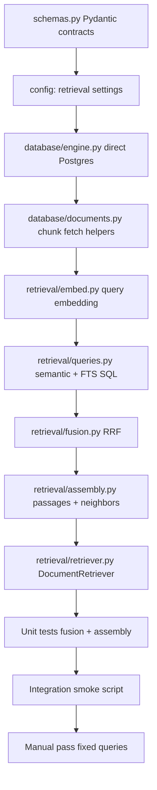

# Phase 5 implementation plan — hybrid retrieval

Wire up hybrid search over the ingested corpus so Phase 6 can ground the LLM on real SEC passages.

Reference: [docs/todos.md](../docs/todos.md) · [docs/architecture.md](../docs/architecture.md) · [docs/client-brief.md](../docs/client-brief.md) · [phase-four-implementation-plan.md](phase-four-implementation-plan.md) · [phase-five-testing-plan.md](phase-five-testing-plan.md) · [phase-six-implementation-plan.md](phase-six-implementation-plan.md)

Pattern reference: [ai-cookbook hybrid-retrieval](https://github.com/daveebbelaar/ai-cookbook/tree/main/knowledge/hybrid-retrieval) — modular retrievers → RRF fusion → orchestrator. Adapted here for **Postgres full-text + pgvector** instead of BM25 + in-memory dense search, with **Pydantic models** as the typed contract layer (document-copilot convention).

**Status:** Complete (2026-06-08).

---

## Goal

Deliver a testable retrieval pipeline:

**User question → embed query → semantic search (pgvector) + lexical search (Postgres FTS) → RRF fusion in Python → fetch passages + document metadata + neighbor context → typed `RetrievalResult`**

After Phase 5, you can run fixed analyst queries against Supabase and get sensible, cite-ready `SourcePassage` objects. No chat API changes, no LLM calls, no reranker.

---

## Current state (as of Phase 4 complete)

| Area | Status |
|------|--------|
| Corpus | **25** `source_documents`, **7,470** `document_chunks`, 100% embedded |
| Indexes | HNSW on `embedding` (`vector_cosine_ops`); GIN on `search_vector` |
| `search_vector` | Generated column: `to_tsvector('english', coalesce(chunk_text, ''))` |
| Query embedding | Reuse `ingest/embeddings.py` + `settings.openai_embedding_model` |
| `app/retrieval/` | Does not exist |
| Direct Postgres access | Not wired in app runtime (Alembic only uses `DATABASE_URL` today) |
| Supabase PostgREST | Used for chat; **not suitable** for pgvector `<=>` or `ts_rank_cd` |
| Chat / agent | Phase 3 stub unchanged; Phase 6 consumes retrieval output |

---

## Pattern mapping: ai-cookbook → Document Copilot

The [hybrid-retrieval tutorial](https://github.com/daveebbelaar/ai-cookbook/tree/main/knowledge/hybrid-retrieval) separates concerns into small, composable units. Document Copilot keeps that shape and adds Pydantic as the glue between layers.

| ai-cookbook | Document Copilot Phase 5 | Notes |
|-------------|--------------------------|-------|
| `BM25Retriever.search()` | `fulltext_search()` in `queries.py` | Postgres `@@ plainto_tsquery` + `ts_rank_cd`, not `bm25s` |
| `DenseRetriever.search()` | `semantic_search()` in `queries.py` | pgvector cosine distance via `<=>`, not numpy dot product |
| `reciprocal_rank_fusion()` in `utils/fusion.py` | `fusion.py` — same algorithm | Fuse **ranks**, not raw scores; default `k=60` |
| `hybrid_candidates()` | `DocumentRetriever.search()` | `candidate_k` per channel, fuse, take top `k` |
| `doc_id` (FiQA `_id`) | `stable_chunk_id` + `chunk_id` (UUID) | `stable_chunk_id` is the citation anchor from ingest |
| Tuple results `(id, score)` | Pydantic `ChunkHit`, `FusedChunkHit`, `SourcePassage` | Typed contracts for tests and Phase 6 agent tools |
| Cohere cross-encoder reranker | **Out of scope** | Architecture stops at RRF; add later if recall needs tuning |
| Parquet + local indexes | Supabase Postgres tables | No separate index files; DB owns ranking |

### Pydantic as the contract layer

ai-cookbook passes raw tuples between functions. Document Copilot should use Pydantic models (same spirit as `app/chat/schemas.py`) so every stage has an explicit input/output type:

```text
RetrievalQuery  →  list[ChunkHit]  →  list[FusedChunkHit]  →  RetrievalResult
     ↑                    ↑                    ↑                      ↑
  user text          per-channel           RRF scores            passages ready
  + filters          ranked hits           + provenance          for agent/grounding
```

This keeps retrieval testable without the LLM and gives Phase 6 a stable `SourcePassage` shape for citation validation.

---

## Build order (dependency graph)



**Rule:** Fusion and assembly must be unit-testable with **mocked** `ChunkHit` lists — no DB or OpenAI required for those tests.

**Rule:** Do not wire retrieval into `POST /chat/stream` in Phase 5. Phase 6 orchestrator injects `DocumentRetriever`.

---

## Target module layout

```text
backend/app/
├── config.py                          # add retrieval_* settings
├── database/
│   ├── engine.py                      # NEW — SQLAlchemy engine / session factory
│   └── documents.py                   # NEW — fetch chunks, neighbors, document metadata
└── retrieval/
    ├── __init__.py
    ├── schemas.py                     # Pydantic: RetrievalQuery, ChunkHit, SourcePassage, ...
    ├── embed.py                       # embed_query(text) → list[float]
    ├── queries.py                     # semantic_search(), fulltext_search()
    ├── fusion.py                      # reciprocal_rank_fusion()
    ├── assembly.py                    # build SourcePassage list from fused hits
    └── retriever.py                   # DocumentRetriever.search() orchestrator
```

Optional dev-only smoke entry point (not a FastAPI route):

```text
backend/scripts/smoke_retrieval.py     # fixed queries from todos + client brief
```

---

## Step 1 — Pydantic schemas (`app/retrieval/schemas.py`)

Define the typed pipeline contracts. Suggested models:

### Input

```python
class RetrievalFilters(BaseModel):
    tickers: list[str] | None = None          # e.g. ["MSFT", "AMZN"]
    fiscal_years: list[int] | None = None     # e.g. [2023, 2024]
    filing_types: list[str] | None = None     # default ["10-K"]

class RetrievalQuery(BaseModel):
    text: str
    filters: RetrievalFilters = Field(default_factory=RetrievalFilters)
```

### Per-channel hits (semantic or full-text)

```python
class RetrievalChannel(str, Enum):
    SEMANTIC = "semantic"
    FULLTEXT = "fulltext"

class ChunkHit(BaseModel):
    chunk_id: UUID
    stable_chunk_id: str
    document_id: UUID
    rank: int                    # 1-based rank within this channel
    score: float                 # semantic: 1 - distance; fulltext: ts_rank_cd
    channel: RetrievalChannel
```

### Post-fusion

```python
class FusedChunkHit(BaseModel):
    chunk_id: UUID
    stable_chunk_id: str
    fused_score: float
    semantic_rank: int | None
    fulltext_rank: int | None
```

### Document + passage (Phase 6 reuses)

```python
class DocumentSummary(BaseModel):
    id: UUID
    ticker: str
    company_name: str
    filing_type: str
    fiscal_year: int
    accession_number: str
    source_url: str

class NeighborChunk(BaseModel):
    chunk_id: UUID
    stable_chunk_id: str
    chunk_index: int
    chunk_text: str
    position: Literal["before", "after"]

class SourcePassage(BaseModel):
    chunk_id: UUID
    stable_chunk_id: str
    document: DocumentSummary
    chunk_text: str
    section_label: str | None
    page_label: str | None
    token_count: int
    chunk_metadata: dict[str, Any]
    neighbors: list[NeighborChunk] = []
    fused_score: float
    channels: list[RetrievalChannel]       # which retrievers surfaced this chunk

class RetrievalResult(BaseModel):
    query: RetrievalQuery
    passages: list[SourcePassage]
    fused_hits: list[FusedChunkHit]        # ranked list before assembly enrichment
    semantic_candidates: int
    fulltext_candidates: int
```

**Design note:** `SourcePassage` may later move to `app/assistant/outputs.py` for Phase 6. Define it once in `retrieval/schemas.py` now and import from there in Phase 6 to avoid duplication.

---

## Step 2 — Retrieval settings (`app/config.py`)

Add tunables (env-overridable, sensible defaults):

| Setting | Default | Purpose |
|---------|---------|---------|
| `retrieval_semantic_top_k` | `50` | Candidates from pgvector (`candidate_k` in ai-cookbook) |
| `retrieval_fulltext_top_k` | `50` | Candidates from Postgres FTS |
| `retrieval_fusion_top_k` | `10` | Final passages returned to agent |
| `retrieval_rrf_k` | `60` | RRF smoothing constant (Cormack et al. convention) |
| `retrieval_neighbor_window` | `1` | Fetch ±N chunks by `chunk_index` within same document |
| `retrieval_min_fulltext_rank` | — | Optional: skip FTS hits below rank threshold (defer) |

Reuse existing embedding settings — do not introduce a second embedding model:

- `openai_embedding_model` = `text-embedding-3-small`
- `openai_embedding_dimensions` = `1536`

---

## Step 3 — Direct Postgres access (`app/database/engine.py`)

Supabase PostgREST cannot express pgvector distance or `ts_rank_cd` ranking. Retrieval needs a **direct** connection via `settings.database_url` (same direct host Alembic uses).

### Checklist

- [ ] `create_engine(settings.database_url, pool_pre_ping=True)` with modest pool size
- [ ] `get_session()` context manager or `session_scope()` for read-only queries
- [ ] Use SQLAlchemy 2.0 `text()` + bound parameters (no string interpolation of user query text into SQL structure)
- [ ] Corpus reads are global (RLS policy `using (true)` for authenticated) — service-role or authenticated JWT both work; prefer **user-scoped** session in Phase 6, service/engine for smoke scripts is fine in Phase 5

**Not in scope:** Alembic changes, new indexes, schema migrations.

---

## Step 4 — Document fetch helpers (`app/database/documents.py`)

Low-level read helpers used by `assembly.py` and optionally `queries.py` for joins.

### Functions

| Function | Purpose |
|----------|---------|
| `fetch_chunks_by_ids(session, chunk_ids)` | Hydrate `chunk_text`, labels, metadata after fusion |
| `fetch_documents_by_ids(session, document_ids)` | Ticker, company, fiscal year, source URL |
| `fetch_neighbor_chunks(session, document_id, chunk_index, window)` | Same-document context for grounding |

Neighbor rule: for chunk at `chunk_index`, fetch `[chunk_index - window, chunk_index + window]` excluding the center chunk. Order by `chunk_index`.

---

## Step 5 — Query embedding (`app/retrieval/embed.py`)

Thin wrapper over existing ingest helper:

```python
def embed_query(text: str, *, client: OpenAI | None = None) -> list[float]:
    return embed_texts([text], client=client)[0]
```

Import from `ingest.embeddings` — same model and dimensions as corpus ingest. Never embed with a different model than was used at ingest time.

---

## Step 6 — Search queries (`app/retrieval/queries.py`)

Two parallel retrievers, mirroring `BM25Retriever` and `DenseRetriever` from ai-cookbook but backed by SQL.

### 6a — Semantic search (pgvector)

```sql
SELECT
    dc.id AS chunk_id,
    dc.stable_chunk_id,
    dc.document_id,
    1 - (dc.embedding <=> :query_embedding::vector) AS score
FROM document_chunks dc
JOIN source_documents sd ON sd.id = dc.document_id
WHERE dc.embedding IS NOT NULL
  -- optional filter clauses on sd.ticker, sd.fiscal_year, sd.filing_type
ORDER BY dc.embedding <=> :query_embedding::vector
LIMIT :top_k
```

- Distance operator: `<=>` (cosine), matching HNSW index `vector_cosine_ops`
- Return `list[ChunkHit]` with `channel=SEMANTIC`, `rank` assigned 1..N in Python after fetch
- Pass embedding as a pgvector literal or `CAST(:vec AS vector)`

### 6b — Full-text search (Postgres FTS, not BM25)

```sql
SELECT
    dc.id AS chunk_id,
    dc.stable_chunk_id,
    dc.document_id,
    ts_rank_cd(dc.search_vector, websearch_to_tsquery('english', :query_text)) AS score
FROM document_chunks dc
JOIN source_documents sd ON sd.id = dc.document_id
WHERE dc.search_vector @@ websearch_to_tsquery('english', :query_text)
  -- optional filter clauses
ORDER BY score DESC
LIMIT :top_k
```

- Use `websearch_to_tsquery` (not `plainto_tsquery`) so analyst-style queries like `AWS operating margin` work naturally
- Generated `search_vector` already uses `to_tsvector('english', ...)` — config must match
- Return `list[ChunkHit]` with `channel=FULLTEXT`

### Filters

Apply optional `RetrievalFilters` as parameterized `AND` clauses on `source_documents`. Empty filter lists mean no restriction (search full corpus).

### Error handling

- Empty FTS result set is valid (semantic-only fusion still works)
- Both channels empty → `RetrievalResult` with `passages=[]` (Phase 6 agent should say "not enough evidence")

---

## Step 7 — RRF fusion (`app/retrieval/fusion.py`)

Port the ai-cookbook algorithm verbatim — fuse rankings, not scores:

```python
def reciprocal_rank_fusion(
    rankings: list[list[ChunkHit]],
    *,
    k: int = 60,
) -> list[FusedChunkHit]:
    """
    rrf_score(d) = sum_r 1 / (k + rank_r(d))
    """
```

### Rules

- Key fusion identity on `stable_chunk_id` (stable across re-ingest; human-debuggable)
- Track `semantic_rank` and `fulltext_rank` per chunk for debugging and future UI
- Sort by `fused_score` descending; break ties by lower `semantic_rank` then `fulltext_rank`
- Input: top `candidate_k` from each channel; output: top `fusion_top_k` `FusedChunkHit` rows

Pure function — **no DB, no OpenAI**. Unit tests live here.

---

## Step 8 — Passage assembly (`app/retrieval/assembly.py`)

After fusion, enrich top hits into agent-ready `SourcePassage` objects:

1. Batch-fetch chunk rows + document metadata for fused `chunk_id`s
2. For each passage, fetch neighbor chunks (`retrieval_neighbor_window`)
3. Attach `channels` list (semantic only, fulltext only, or both)
4. Preserve `fused_score` for ordering

Output order matches fused ranking.

---

## Step 9 — Orchestrator (`app/retrieval/retriever.py`)

Single entry point, analogous to ai-cookbook `search_hybrid()`:

```python
class DocumentRetriever:
    def __init__(self, session_factory, settings: Settings, openai_client: OpenAI | None = None):
        ...

    def search(self, query: RetrievalQuery) -> RetrievalResult:
        embedding = embed_query(query.text)
        semantic_hits = semantic_search(session, embedding, query.filters, k=settings.retrieval_semantic_top_k)
        fulltext_hits = fulltext_search(session, query.text, query.filters, k=settings.retrieval_fulltext_top_k)
        fused = reciprocal_rank_fusion([semantic_hits, fulltext_hits], k=settings.retrieval_rrf_k)
        fused = fused[: settings.retrieval_fusion_top_k]
        passages = assemble_passages(session, fused, semantic_hits, fulltext_hits, window=settings.retrieval_neighbor_window)
        return RetrievalResult(...)
```

Constructor accepts dependencies explicitly (session factory, settings) — no globals. Phase 6 injects this into `DocumentAgentDeps`.

---

## Testing plan

See **[phase-five-testing-plan.md](phase-five-testing-plan.md)** for the full validation strategy: unit layers, live smoke script, pass/fail matrix, re-run triggers, and Phase 6 handoff criteria.

Quick commands:

```powershell
cd backend
uv run pytest tests/retrieval/ -v              # unit tests (no network)
uv run python scripts/smoke_retrieval.py       # live corpus smoke
```

---

## Definition of done (Phase 5)

- [x] `app/retrieval/schemas.py` — Pydantic contracts for full pipeline
- [x] `app/retrieval/queries.py` — pgvector semantic + Postgres FTS search
- [x] `app/retrieval/fusion.py` — RRF in Python
- [x] `app/retrieval/retriever.py` — fuse, fetch passages + neighbors + document metadata
- [x] `app/database/engine.py` + `documents.py` — direct Postgres read path
- [x] Retrieval settings in `app/config.py`
- [x] Unit tests: fusion ranking and passage assembly pass (`uv run pytest tests/retrieval/`)
- [x] Manual smoke: fixed queries return sensible chunks from live Supabase corpus (`uv run python scripts/smoke_retrieval.py`)
- [x] No changes to `POST /chat/stream` (stub remains)

---

## Explicitly out of scope (Phase 5)

| Item | Deferred to |
|------|-------------|
| Cross-encoder reranker (Cohere / BGE) | Optional tuning after baseline eval |
| FastAPI retrieval routes | Phase 6 agent tools call `DocumentRetriever` in-process |
| PydanticAI agent / grounding | Phase 6 |
| Citation UI | Phase 7 |
| New Alembic migrations or index changes | Not needed — Phase 1 schema is sufficient |
| Re-ingest or embedding model change | Only if corpus changes |
| BM25 / `bm25s` / external sparse index | Postgres FTS replaces sparse leg |
| Agent-generated SQL | Architecture forbids — bounded tools only |

---

## What Phase 6 reuses unchanged

| Phase 6 module | Phase 5 deliverable |
|----------------|---------------------|
| `assistant/deps.py` | Inject `DocumentRetriever` |
| `assistant/agent.py` tools: `search_filings`, `read_chunk`, `read_surrounding_chunks` | Wrap `DocumentRetriever.search()` + `documents.py` helpers |
| `assistant/outputs.py` | Import `SourcePassage`, `DocumentSummary` from `retrieval/schemas.py` |
| `grounding/validator.py` | Validate citations against `RetrievalResult.passages` |
| `chat/orchestrator.py` | `retriever.search(RetrievalQuery(text=user_message))` before agent run |

---

## Suggested work split (solo, ~2 days)

| Day | Focus |
|-----|-------|
| 1 | `schemas.py`, `engine.py`, `embed.py`, `queries.py` — prove both SQL legs against Supabase |
| 2 | `fusion.py`, `assembly.py`, `retriever.py`, unit tests, smoke script, manual pass |

---

## Architecture references

Retrieval path (this phase):

```text
RetrievalQuery (Pydantic)
       ↓
embed_query() ──→ OpenAI text-embedding-3-small
       ↓
┌──────────────────────┬──────────────────────┐
│ semantic_search()    │ fulltext_search()    │
│ pgvector <=>         │ search_vector @@     │
│ document_chunks      │ websearch_to_tsquery │
└──────────┬───────────┴──────────┬───────────┘
           │    list[ChunkHit]     │
           └──────────┬────────────┘
                      ↓
           reciprocal_rank_fusion()   ← same as ai-cookbook 4-rrf.py
                      ↓
           assemble_passages()        ← neighbors + document metadata
                      ↓
           RetrievalResult (Pydantic) ← ready for Phase 6 agent
```

Corpus tables (unchanged from Phase 4):

```text
source_documents
  id, ticker, company_name, filing_type, fiscal_year,
  accession_number (unique), source_url, markdown_content

document_chunks
  id, document_id, stable_chunk_id (unique), chunk_index,
  chunk_text, page_label, section_label, token_count,
  chunk_metadata (jsonb), embedding vector(1536),
  search_vector tsvector (generated)
```

---

## Open decisions (resolve before implementation)

1. **Session auth for retrieval reads:** Use direct `DATABASE_URL` with service role equivalent, or set Postgres `request.jwt.claim.sub` for RLS? Recommendation: direct engine with service-level pool for Phase 5 smoke; pass user-scoped Supabase JWT into a dedicated retrieval session factory in Phase 6 if audit requirements tighten.

2. **`SourcePassage` ownership:** Keep in `retrieval/schemas.py` and re-export from `assistant/outputs.py`, or move shared types to `app/models/retrieval.py`. Recommendation: `retrieval/schemas.py` owns it; assistant imports.

3. **Reranker:** Skip for v1 per architecture. Revisit if manual smoke shows good chunks ranked too low (common with financial tables and ticker-heavy queries).

4. **FTS query parser:** Start with `websearch_to_tsquery('english', ...)`. If ticker symbols get stemmed incorrectly, fall back to `plainto_tsquery` for single-token queries — detect in `queries.py` only if smoke tests fail.
