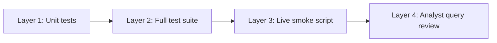

# Phase 5 testing plan — hybrid retrieval

Validate that the retrieval pipeline returns **cite-ready, on-topic SEC passages** from the ingested corpus before Phase 6 wires the real agent.

Related: [phase-five-implementation-plan.md](phase-five-implementation-plan.md) · [docs/todos.md](../docs/todos.md) · [docs/client-brief.md](../docs/client-brief.md) · [backend/scripts/smoke_retrieval.py](../backend/scripts/smoke_retrieval.py)

---

## Purpose

Phase 5 delivers hybrid search: pgvector semantic retrieval + Postgres full-text search + RRF fusion + passage assembly. Testing must confirm:

1. Each pipeline stage behaves correctly in isolation (fusion, assembly, schemas).
2. Both SQL retrieval legs return sensible ranked hits against the live corpus.
3. End-to-end `DocumentRetriever.search()` produces typed `SourcePassage` objects analysts can verify.
4. Low-recall queries fail gracefully (empty or semantic-only results) — Phase 6 will refuse to invent facts.

This document defines **what to test**, **when to run it**, and **pass/fail thresholds** — not implementation details.

---

## Definition of “correct” retrieval

Success is measured by downstream grounding utility, not perfect ranking.

| Goal | Pass criteria |
|------|----------------|
| **Pipeline integrity** | `RetrievalQuery` → `RetrievalResult` completes without error; all passages have non-empty `chunk_text`, valid `document` metadata, and `stable_chunk_id` |
| **Semantic leg** | Paraphrased analyst questions return chunks from the expected ticker(s) in the top 10 fused results |
| **Full-text leg** | Keyword-heavy queries (ticker symbols, segment names, `AWS`, `Data Center`) surface hits via the `fulltext` channel on at least one passage |
| **Hybrid fusion** | Chunks appearing in **both** channels rank above single-channel-only hits with comparable raw scores |
| **Passage assembly** | Top passages include `section_label` when available, `fused_score`, `channels`, and ±1 neighbor chunks when `retrieval_neighbor_window=1` |
| **Filters** | Optional `RetrievalFilters` (ticker, fiscal year) restrict results without SQL errors |
| **Empty recall** | Queries with weak corpus support return `passages=[]` or semantic-only hits — not fabricated text |

**Not required for Phase 5 v1:**

- Optimal NDCG@10 or benchmark-grade ranking
- Cross-encoder reranking
- FastAPI retrieval routes
- Chat stream integration (`POST /chat/stream` stays stubbed)
- Perfect table-cell readability in passage previews (Docling artifacts are acceptable)

---

## Prerequisites

Before running integration or smoke tests:

| Requirement | Check |
|-------------|-------|
| Phase 4 ingest complete | Supabase has 25 `source_documents`, ~7,470 `document_chunks`, non-null embeddings |
| `backend/.env` populated | `DATABASE_URL` (direct `db.<ref>.supabase.co`), `OPENAI_API_KEY`, Supabase keys |
| Direct Postgres URL | Must **not** use `pooler.supabase.com` — same rule as Alembic |
| Corpus unchanged | Re-run smoke after re-ingest or embedding model change |

---

## Validation layers

Run checks from cheapest (no network) to most expensive (live DB + OpenAI).



### Layer 1 — Unit tests (no external services)

**When:** Every code change to `app/retrieval/` or `app/database/documents.py`.  
**Blocks merge:** Yes.  
**Runtime:** &lt; 5 seconds.

```powershell
cd backend
uv run pytest tests/retrieval/ -v
```

| File | What it proves |
|------|----------------|
| `tests/retrieval/test_fusion.py` | RRF prefers chunks in both lists; uses rank not raw score; empty input returns `[]` |
| `tests/retrieval/test_assembly.py` | Neighbor `before`/`after` positions; channel provenance (`semantic`, `fulltext`, or both); empty fused list → `[]` |
| `tests/retrieval/test_schemas.py` | `RetrievalQuery` rejects empty text; filters default to unrestricted search |

**Pass:** All tests green, no skips.

---

### Layer 2 — Full backend regression

**When:** Before committing Phase 5 changes or starting Phase 6.  
**Blocks merge:** Yes (ensures retrieval did not break chat/API tests).

```powershell
cd backend
uv run pytest -v
```

**Pass:** Full suite green (currently 35+ tests including chat, ingest, retrieval).

---

### Layer 3 — Live smoke script

**When:** After Phase 5 implementation, after re-ingest, after changing retrieval settings or SQL.  
**Blocks Phase 6:** Yes.  
**Requires:** Live Supabase + OpenAI (one embedding call per query).

```powershell
cd backend
uv run python scripts/smoke_retrieval.py
```

**Pass:** Exit code `0`. Script runs five fixed queries and prints top-3 passage previews.

#### Smoke query matrix

| Query | Must return passages? | Expected ticker(s) | Expected channels | Notes |
|-------|----------------------|--------------------|-------------------|-------|
| `AWS operating margin` | Yes | `AMZN` | semantic + fulltext on top hit | Segment / AWS operating metrics |
| `NVIDIA data center demand` | Yes | `NVDA` | semantic + fulltext on top hit | Data Center business narrative |
| `Azure AI infrastructure capacity` | Yes | `MSFT` | semantic + fulltext on at least one top-3 hit | Cloud / AI capacity language |
| `Apple Services revenue mix` | Yes | `AAPL` | semantic and/or fulltext | Services segment revenue |
| `generative AI improved margins` | Optional (may be sparse) | Any or none | Often semantic-only | Valid low-FTS case; script allows empty FTS |

#### Smoke output checks (manual eyeball)

For each non-empty query, confirm in the printed preview:

- [ ] `ticker` matches expected company
- [ ] `fiscal_year` is within corpus range (2021–2025)
- [ ] `channels=` includes at least one retriever for top hits (except low-recall query)
- [ ] Preview text is SEC filing prose, not empty or pure table separators
- [ ] `fused=10` and `passages=10` when both channels return candidates (settings default)

**Fail signals:**

- `ModuleNotFoundError: psycopg2` → `engine.py` must use `postgresql+psycopg://` URL (psycopg3)
- Connection refused / pooler error → fix `DATABASE_URL` to direct host
- All queries return 0 passages → embeddings missing or wrong DB project
- Wrong ticker dominant in top-3 → investigate fusion weights or FTS parser

---

### Layer 4 — Analyst query review (manual)

**When:** Before Phase 6 agent wiring; repeat after retrieval tuning.  
**Who:** Developer or analyst spot-check.  
**Duration:** ~15 minutes.

Run smoke script, then manually inspect full `SourcePassage` for 2–3 queries:

```python
from app.retrieval import DocumentRetriever, RetrievalQuery

retriever = DocumentRetriever()
result = retriever.search(RetrievalQuery(text="AWS operating margin"))
passage = result.passages[0]
print(passage.document.ticker, passage.section_label)
print(passage.chunk_text[:500])
print([n.position for n in passage.neighbors])
```

| Check | Pass |
|-------|------|
| Citation anchor | `stable_chunk_id` matches `{accession_number}:{chunk_index}` pattern |
| Document metadata | `company_name`, `accession_number`, `source_url` populated |
| Neighbor context | With `retrieval_neighbor_window=1`, adjacent chunks from same filing appear |
| Filter scoping | `RetrievalQuery(text="...", filters=RetrievalFilters(tickers=["NVDA"]))` returns only NVDA |

Optional client-brief queries to spot-check (not automated in v1):

1. Apple revenue mix 2021–2025
2. Microsoft Azure / AI infrastructure changes
3. Cross-company AI risk-factor language
4. “Prove generative AI improved margins” → expect weak evidence (Phase 6 refusal case)

---

## Per-module test coverage map

| Module | Unit tested? | Integration tested? | How |
|--------|-------------|----------------------|-----|
| `retrieval/schemas.py` | Yes | — | `test_schemas.py` |
| `retrieval/fusion.py` | Yes | — | `test_fusion.py` |
| `retrieval/assembly.py` | Yes (mocked DB) | Smoke | `test_assembly.py` + smoke script |
| `retrieval/queries.py` | No (yet) | Smoke | SQL legs exercised end-to-end |
| `retrieval/embed.py` | No | Smoke | OpenAI called per smoke query |
| `retrieval/retriever.py` | No | Smoke | Full `search()` path |
| `database/engine.py` | No | Smoke | Session connects on first query |
| `database/documents.py` | Partial (via assembly mock) | Smoke | Fetch + neighbors in assembly |

### Recommended future automated tests (optional)

Add when retrieval tuning becomes frequent:

| Test | Type | Approach |
|------|------|----------|
| `test_semantic_search_returns_results` | Integration (`pytest.mark.integration`) | Skip if no `DATABASE_URL`; assert `len(hits) > 0` for known query |
| `test_fulltext_search_returns_amzn_for_aws` | Integration | Assert top hit `stable_chunk_id` maps to AMZN document |
| `test_retrieval_filters_by_ticker` | Integration | `RetrievalFilters(tickers=["NVDA"])` → all passages `ticker == "NVDA"` |
| `test_reciprocal_rank_fusion_k_sensitivity` | Unit | Parametrize `k=60` vs `k=10`; order stable for fixture rankings |

Mark integration tests with `@pytest.mark.integration` and skip by default in CI until a test DB is available.

---

## Configuration under test

Defaults in `app/config.py` (override via env):

| Setting | Default | Test impact |
|---------|---------|-------------|
| `retrieval_semantic_top_k` | 50 | Candidate pool for fusion |
| `retrieval_fulltext_top_k` | 50 | Candidate pool for fusion |
| `retrieval_fusion_top_k` | 10 | Final passages returned |
| `retrieval_rrf_k` | 60 | RRF smoothing — unit tests use `k=60` |
| `retrieval_neighbor_window` | 1 | Assembly neighbor count — unit test asserts before/after |
| `openai_embedding_model` | `text-embedding-3-small` | Must match ingest model |

Re-run Layer 3 smoke after changing any of these values.

---

## When to re-run tests

| Event | Layers to run |
|-------|---------------|
| Edit `fusion.py`, `assembly.py`, `schemas.py` | 1, 2 |
| Edit `queries.py`, `engine.py`, `documents.py` | 1, 2, 3 |
| Change `retrieval_*` settings | 3 |
| Re-ingest corpus or change embedding model | 3, 4 |
| Schema migration on `document_chunks` | 2, 3, 4 |
| Before starting Phase 6 | 2, 3, 4 |

---

## Phase 6 handoff criteria

Phase 5 retrieval is ready for agent integration when:

- [ ] `uv run pytest tests/retrieval/ -v` — all green
- [ ] `uv run pytest -v` — full suite green
- [ ] `uv run python scripts/smoke_retrieval.py` — exit code 0
- [ ] Manual spot-check: at least 3 smoke queries return on-topic AMZN / NVDA / MSFT / AAPL passages
- [ ] `SourcePassage` shape stable — Phase 6 imports from `app/retrieval/schemas.py`
- [ ] `POST /chat/stream` unchanged (stub still works — run chat API tests)

Phase 6 will add:

- Citation validation against `RetrievalResult.passages`
- Agent tool tests (`search_filings`, `read_chunk`, `read_surrounding_chunks`)
- End-to-end grounded answer tests from [client-brief.md](../docs/client-brief.md)

---

## Quick reference commands

```powershell
# Unit tests only (fast, no network)
cd backend
uv run pytest tests/retrieval/ -v

# Full backend regression
uv run pytest -v

# Live corpus smoke (Supabase + OpenAI)
uv run python scripts/smoke_retrieval.py

# Lint retrieval modules
uv run ruff check app/retrieval app/database/engine.py app/database/documents.py tests/retrieval
```

---

## Definition of done (testing)

- [x] Unit tests for fusion, assembly, and schemas committed under `tests/retrieval/`
- [x] Smoke script committed at `backend/scripts/smoke_retrieval.py`
- [x] Smoke pass recorded against live Supabase corpus (2026-06-08)
- [ ] Optional: pytest integration markers for SQL legs (defer until CI test DB exists)
- [ ] Optional: automated ticker-assertion tests in smoke script (defer — eyeball sufficient for v1)
