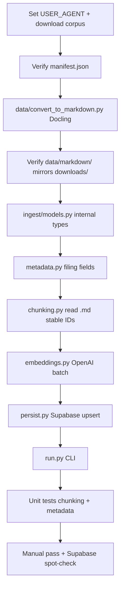

# Phase 4 implementation plan — corpus download & ingestion

Populate Supabase with parsed, chunked, and embedded SEC 10-K filings so Phase 5 hybrid retrieval has something to search.

Reference: [docs/todos.md](../docs/todos.md) · [docs/architecture.md](../docs/architecture.md) · [docs/client-brief.md](../docs/client-brief.md)

---

## Goal

Deliver an indexed corpus in Postgres:

**Download filings → parse to Markdown → chunk with stable IDs → embed → upsert to Supabase → spot-check in dashboard**

After Phase 4, `source_documents` and `document_chunks` contain the sample corpus (AAPL, MSFT, NVDA, AMZN, GOOGL — fiscal years 2021–2025) and are ready for pgvector + full-text queries in Phase 5.

---

## Current state (as of Phase 4 complete)

| Area | Status |
|------|--------|
| DB schema | Done — `source_documents`, `document_chunks` with `embedding vector(1536)`, generated `search_vector`, HNSW + GIN indexes |
| RLS | Done — authenticated read on corpus tables; writes use **service role** from backend scripts |
| Download script | Done — `data/download.py` (SEC EDGAR, manifest JSON, gitignored `data/downloads/`) |
| HTML → Markdown | Done — `data/convert_to_markdown.py` via [Docling](https://docling-project.github.io/docling/); output in gitignored `data/markdown/` |
| Docling dependency | Done — `docling==2.96.1` in `backend/pyproject.toml` dev group |
| Ingestion code | Done — `backend/ingest/` (metadata, chunking, embeddings, persist, CLI) |
| Corpus in Supabase | Done — **25** documents, **7,470** chunks, all embeddings populated (2026-06-08) |
| Ingest issues log | Done — [backend/ingest/INGESTION_ISSUES.md](../backend/ingest/INGESTION_ISSUES.md) |
| Markdown validation strategy | Done — [data/markdown-testing-strategy.md](../data/markdown-testing-strategy.md) |
| OpenAI config | Done — `OPENAI_API_KEY`, `openai_embedding_model`, `openai_embedding_dimensions` in `app/config.py` |
| Retrieval / agent | Out of scope — Phases 5–6 |

---

## Build order (dependency graph)



**Rule:** Do not start Phase 5 retrieval until at least one full company’s filings ingest end-to-end with non-null embeddings and sensible chunk text.

**Rule:** Run Docling conversion (`data/convert_to_markdown.py`) before ingest. Ingest reads **Markdown** from `data/markdown/`, not raw HTML.

---

## Step 0 — Download the corpus

### Checklist

- [ ] Edit `data/download.py`: set `USER_AGENT` to `"Document Copilot you@driftwood.com"` (SEC requires identifying contact)
- [ ] Run from repo root: `uv run data/download.py`
- [ ] Confirm ~25 filings (5 tickers × 5 years) under `data/downloads/<year>/`
- [ ] Confirm `data/downloads/manifest.json` lists every filing with `ticker`, `accession_number`, `source_url`, `local_path`

### Manifest shape (already produced by download script)

Each entry in `manifest.filings[]`:

```json
{
  "ticker": "AAPL",
  "cik": "0000320193",
  "form": "10-K",
  "filing_date": "2024-11-01",
  "report_date": "2024-09-28",
  "accession_number": "0000320193-24-000123",
  "primary_document": "aapl-20240928.htm",
  "source_url": "https://www.sec.gov/Archives/edgar/data/...",
  "local_path": "2024/aapl_10-k_2024-11-01_....html"
}
```

---

## Step 1 — HTML → Markdown (Docling)

Convert raw SEC HTML to normalized Markdown **before** ingest. This is a separate offline step under `data/`, not part of `backend/ingest/`.

### Script: `data/convert_to_markdown.py`

Uses Docling’s [`DocumentConverter`](https://docling-project.github.io/docling/getting_started/quickstart/):

```python
from docling.document_converter import DocumentConverter

converter = DocumentConverter()
result = converter.convert(str(html_path))
markdown = result.document.export_to_markdown()
```

### Input / output layout

Mirrors the downloads folder structure:

```text
data/downloads/2024/aapl_10-k_2024-11-01_....htm
       ↓
data/markdown/2024/aapl_10-k_2024-11-01_....md
```

Both `data/downloads/*` and `data/markdown/*` are gitignored (large artifacts). Only scripts and `.gitkeep` files are tracked.

### Run

Docling is installed in the **backend dev** dependency group (`docling==2.96.1`). Run from `backend/`:

```powershell
cd backend
uv run python ../data/convert_to_markdown.py
```

Options:

| Flag | Behavior |
|------|----------|
| `--force` | Reconvert even when `.md` exists and is newer than source HTML |
| `--ticker AAPL` | Only convert files whose name starts with that ticker |

Skips files when the output `.md` exists and is at least as new as the source HTML (unless `--force`).

### Checklist

- [x] `data/convert_to_markdown.py` — batch convert all `.htm`/`.html` under `data/downloads/`
- [x] Output under `data/markdown/` with same year subfolders and filename stems
- [x] `docling==2.96.1` in `backend/pyproject.toml` `[dependency-groups] dev`
- [x] `.gitignore` entries for `/data/markdown/*` and `!/data/markdown/.gitkeep`
- [ ] Re-run after new downloads: `uv run python ../data/convert_to_markdown.py --force`

### Verified (local corpus)

- 25 HTML filings → 25 Markdown files under `markdown/2021/` … `markdown/2025/`
- ~4–24 seconds per filing (MSFT largest/slowest)
- SEC table markup may appear as Markdown tables or artifacts — acceptable for v1; chunking can skip boilerplate

### Why Docling (not BeautifulSoup + html2text)

- Handles messy SEC HTML, layout, and reading order better than ad-hoc parsing
- Single dependency with Markdown export built in
- Supports HTML natively among [many formats](https://docling-project.github.io/docling/)
- Local execution — no API calls during conversion

---

## Step 2 — Ingestion module layout

Create `backend/ingest/` as **CLI scripts**, not FastAPI routes. Corpus writes are operator-run, idempotent, and use the service-role Supabase client.

Ingest reads **Markdown** from `data/markdown/` (mapped from manifest `local_path` by swapping extension and root folder).

```text
data/
├── download.py              # SEC EDGAR fetch → downloads/
├── convert_to_markdown.py   # Docling HTML → markdown/  (Step 1, done)
├── downloads/               # raw .htm (gitignored)
└── markdown/                # converted .md (gitignored)

backend/ingest/
├── __init__.py
├── INGESTION_ISSUES.md   # Phase 4 errors found/fixed during ingest (operational log)
├── models.py        # DocumentMetadata, ChunkRecord (internal dataclasses / Pydantic)
├── metadata.py      # Manifest → SourceDocument fields; resolve markdown path
├── chunking.py      # Markdown file → ChunkRecord list (section_label truncated to 255)
├── embeddings.py    # OpenAI embed batch helper
├── persist.py       # Upsert source_documents + document_chunks (retry + batch size 25)
└── run.py           # CLI: chunk → embed → persist
```

Register as a runnable module in `pyproject.toml` if desired:

```toml
[project.scripts]
ingest-corpus = "ingest.run:main"
```

Or invoke: `cd backend && uv run python -m ingest.run`

### Manifest → Markdown path helper

Manifest entries use `local_path` relative to `downloads/` (e.g. `2024/aapl_10-k_....htm`). Ingest resolves the Markdown sibling:

```python
def markdown_path_for(manifest_entry: dict, downloads_root: Path, markdown_root: Path) -> Path:
    rel = Path(manifest_entry["local_path"])
    return markdown_root / rel.with_suffix(".md")
```

Fail fast if the `.md` file is missing — run `convert_to_markdown.py` first.

---

## Step 3 — Metadata extraction

Map manifest + Markdown file → fields required by `source_documents`:

| DB column | Source |
|-----------|--------|
| `ticker` | manifest `ticker` |
| `company_name` | SEC submissions JSON (`name` field) or static `COMPANY_NAMES` map keyed by ticker |
| `filing_type` | manifest `form` (e.g. `10-K`) |
| `fiscal_year` | `int(report_date[:4])` or filing year from manifest |
| `accession_number` | manifest (unique key for upsert) |
| `source_url` | manifest |
| `markdown_content` | contents of matching file in `data/markdown/` |

### Checklist

- [x] `markdown_path_for(manifest_entry) -> Path` — downloads → markdown path mapping (normalizes Windows `\` in manifest paths)
- [x] `build_document_metadata(manifest_entry, markdown) -> DocumentMetadata`
- [x] Unit tests with fixture manifest rows (`tests/corpus_ingest/test_metadata.py`)
- [x] Reject empty markdown; fail if `.md` missing (prompt to run convert script)

---

## Step 4 — Chunking

### Design (from architecture)

Each chunk row needs:

| Field | Rule |
|-------|------|
| `stable_chunk_id` | Deterministic: `{accession_number}:{chunk_index}` or `{ticker}-{fiscal_year}-{chunk_index}` — **must be stable across re-ingest** |
| `chunk_index` | 0-based order within document |
| `chunk_text` | Retrieval passage text |
| `page_label` | Best-effort from Docling structure if available later; else `None` for v1 |
| `section_label` | Nearest preceding heading (e.g. `Item 7 — MD&A`); **truncated to 255 chars** for MSFT/table artifacts |
| `token_count` | Approximate (chars/4) or `tiktoken` if added |
| `chunk_metadata` | JSON: `{ ticker, company_name, filing_type, fiscal_year, accession_number, source_url, char_start, char_end }` |
| `embedding` | Filled in Step 5 |
| `search_vector` | **Do not write** — generated column from `chunk_text` |

### Chunking strategy (v1)

1. Split Markdown on major headings (`#`, `##`, or regex for `Item \d`)
2. Sub-split sections longer than ~800 tokens into overlapping windows (~100 token overlap)
3. Drop chunks shorter than ~50 tokens (boilerplate noise)

### Checklist

- [x] `chunk_markdown(metadata, markdown) -> list[ChunkRecord]`
- [x] Stable IDs verified: same input → same `stable_chunk_id` set
- [x] Unit tests: section labels, max chunk size, overlap (`tests/corpus_ingest/test_chunking.py`)
- [x] `_normalize_section_label()` — prevents Postgres `varchar(255)` overflow (see [INGESTION_ISSUES.md](../backend/ingest/INGESTION_ISSUES.md))

---

## Step 5 — Embeddings

Use existing settings from `app/config.py`:

- Model: `text-embedding-3-small`
- Dimensions: `1536`

### Checklist

- [x] `embed_texts(texts: list[str]) -> list[list[float]]` — batch in groups of 64
- [x] Retry on rate limit (exponential backoff)
- [ ] Skip re-embedding unchanged chunks on re-ingest (deferred — full re-chunk + re-embed is acceptable for v1)

Integration test (optional, `@pytest.mark.integration`): embed one short string and assert length 1536.

---

## Step 6 — Persistence (Supabase service role)

Use `get_service_role_client()` from `app/database/supabase.py`.

### Upsert rules

| Table | Key | On conflict |
|-------|-----|-------------|
| `source_documents` | `accession_number` | Update `markdown_content`, `updated_at`; keep same `id` if exists |
| `document_chunks` | `stable_chunk_id` | Replace text/metadata/embedding; delete orphaned chunks for document if full re-chunk |

**Order:** upsert document first → delete old chunks for that document (if re-ingesting) → insert new chunks in batches.

`search_vector` updates automatically when `chunk_text` changes.

### Checklist

- [x] `upsert_document(client, metadata) -> uuid`
- [x] `replace_document_chunks(client, document_id, chunks_with_embeddings)`
- [x] Batch inserts (**25** rows per batch — reduced from 50 after disconnect errors; see [INGESTION_ISSUES.md](../backend/ingest/INGESTION_ISSUES.md))
- [x] `_execute_with_retry()` — exponential backoff on transient Supabase/HTTP failures
- [x] Log counts: documents processed, chunks written, embeddings created

---

## Step 7 — CLI entrypoint (`run.py`)

```powershell
# Prerequisites: corpus downloaded and converted to Markdown
cd backend
uv run python ../data/convert_to_markdown.py

# Ingest
uv run python -m ingest.run --manifest ../data/downloads/manifest.json
uv run ingest-corpus                          # same via pyproject script entry

# Optional filters
uv run python -m ingest.run --ticker AAPL
uv run python -m ingest.run --dry-run         # chunk only, no OpenAI/Supabase
uv run python -m ingest.run --documents-only  # source_documents only
uv run python -m ingest.run --skip-embeddings # chunks without vectors (debug)
```

### Checklist

- [x] Load manifest; resolve each filing’s Markdown path under `data/markdown/`
- [x] `--dry-run` for chunk validation without API cost
- [x] Exit non-zero on first hard failure (missing file, parse error, Supabase error)
- [x] Summary at end: N documents, M chunks, embeddings created
- [x] ASCII-only log output (Windows PowerShell safe)

---

## Step 8 — Unit tests

Location: `backend/tests/corpus_ingest/` (**not** `tests/ingest/` — that name shadows the `ingest` package)

| File | Covers |
|------|--------|
| `test_metadata.py` | fiscal year, accession, company name, markdown path resolution |
| `test_chunking.py` | section splits, stable IDs, max size, overlap |
| `test_convert_to_markdown.py` | optional — Docling smoke test on one fixture HTML (mark `@pytest.mark.integration` if slow) |

**No network in default suite.** Mock OpenAI and Supabase in integration tests; mark with `@pytest.mark.integration`.

Run: `cd backend && uv run pytest tests/corpus_ingest/`

---

## Issues encountered during ingestion

Full write-up: [backend/ingest/INGESTION_ISSUES.md](../backend/ingest/INGESTION_ISSUES.md)

| Issue | Fix |
|-------|-----|
| `section_label` > 255 chars (MSFT) | Truncate in `chunking._normalize_section_label()` |
| Supabase `Server disconnected` / SSL errors | Retry + smaller chunk batch size in `persist.py` |
| Windows `charmap` on Unicode log arrow | ASCII `->` in `run.py` |
| `tests/ingest/` shadowing package | Renamed to `tests/corpus_ingest/` |
| Dry-run summary miscount | Return `(0, 0)` when `--dry-run` |

---

## Manual pass

| Step | Action | Expected |
|------|--------|----------|
| 1 | Set `USER_AGENT`, run `uv run data/download.py` | ~25 HTML files + manifest |
| 2 | Run `cd backend && uv run python ../data/convert_to_markdown.py` | ~25 `.md` files under `data/markdown/{year}/` |
| 3 | Spot-check one `.md` (e.g. AAPL 2024) | Readable 10-K prose; headings and form text present |
| 4 | Run full ingest CLI | Completes without error; logs 25 documents |
| 5 | Supabase → `source_documents` | 25 rows; tickers AAPL/MSFT/NVDA/AMZN/GOOGL; `markdown_content` non-empty |
| 6 | Supabase → `document_chunks` | ~7,470 rows; `embedding` not null; `search_vector` populated |
| 7 | Sample query | `select ticker, fiscal_year, left(chunk_text, 80) from document_chunks join source_documents ... limit 5` returns readable SEC prose |
| 8 | Re-run ingest | Idempotent — no duplicate accession rows; chunk counts stable |
| 9 | Chat app still works | Phase 3 stub chat unaffected (corpus is read-only for analysts) |

Steps 4–8 verified **2026-06-08** (25 docs, 7,470 chunks, 100% embedded).

**Failure signals:**

- Docling import error → run from `backend/` venv (`uv run python ../data/convert_to_markdown.py`), not standalone `uv run data/...` with inline deps
- Missing `.md` for a filing → re-run convert script; check manifest `local_path` matches downloads layout
- `varchar(255)` on chunk insert → long `section_label`; confirm truncation in `chunking.py`
- `Server disconnected` / SSL errors → retry ticker ingest; see [INGESTION_ISSUES.md](../backend/ingest/INGESTION_ISSUES.md)
- `401` from OpenAI → check `OPENAI_API_KEY`
- Supabase write errors → confirm service role key; corpus tables exist
- Empty chunks → inspect source Markdown; adjust chunking thresholds
- All embeddings null → embedding step skipped or failed silently; fix before Phase 5

---

## Definition of done (Phase 4)

- [x] Sample corpus downloaded for all 5 tickers (2021–2025 10-Ks)
- [x] All downloaded HTML converted to Markdown via Docling (`data/markdown/` mirrors `downloads/`)
- [x] Ingest CLI runs end-to-end: load Markdown → chunk → embed → persist
- [x] `source_documents` and `document_chunks` populated in Supabase with correct metadata
- [x] Embeddings present (1536-dim); generated `search_vector` indexed
- [x] Unit tests for metadata + chunking pass (`tests/corpus_ingest/`)
- [x] Re-ingest is idempotent
- [x] Manual pass complete (2026-06-08)
- [x] Ingestion issues documented in [INGESTION_ISSUES.md](../backend/ingest/INGESTION_ISSUES.md)

---

## Explicitly out of scope (Phase 4)

- Hybrid retrieval, RRF fusion (Phase 5)
- Real LLM answers or citation UI (Phases 6–7)
- FastAPI ingest routes or frontend upload UI
- 10-Q, earnings transcripts, full S&P 500 corpus
- Incremental “watch SEC for new filings” automation
- Object storage for raw HTML or Markdown (files stay in gitignored `data/downloads/` and `data/markdown/`)
- Re-running Docling on every ingest (conversion is a separate offline step)

---

## Dependencies

| Package | Where | Purpose |
|---------|-------|---------|
| `docling==2.96.1` | `backend/pyproject.toml` dev group | HTML → Markdown conversion (`data/convert_to_markdown.py`) |

Optional later: `tiktoken` for accurate token counts in chunking (can defer — use char/4 heuristic in v1).

**Not needed:** `beautifulsoup4`, `html2text` — superseded by Docling.

Install/sync: `cd backend && uv sync`

---

## Suggested work split (solo, ~2–3 days)

| Day | Focus |
|-----|-------|
| 1 | Download corpus; run Docling conversion; inspect Markdown quality |
| 2 | `metadata.py` + `chunking.py` + tests; `embeddings.py`; dry-run CLI |
| 3 | `persist.py` + full ingest; Supabase spot-check; idempotent re-run; manual pass |

**Completed 2026-06-08.** Operational notes for re-ingest: [INGESTION_ISSUES.md](../backend/ingest/INGESTION_ISSUES.md).

---

## What Phase 5 reuses unchanged

- `source_documents` / `document_chunks` schema and indexes
- `stable_chunk_id` as citation anchor
- `chunk_metadata` JSON for passage assembly
- Generated `search_vector` — Phase 5 queries it, Phase 4 never writes it

Phase 5 adds `app/retrieval/` query modules only — no re-ingest required unless corpus changes.

---

## Architecture references

Corpus tables (already migrated):

```text
source_documents
  id, ticker, company_name, filing_type, fiscal_year,
  accession_number (unique), source_url, markdown_content

document_chunks
  id, document_id, stable_chunk_id (unique), chunk_index,
  chunk_text, page_label, section_label, token_count,
  chunk_metadata (jsonb), embedding vector(1536),
  search_vector tsvector (generated)
```

Ingestion path (this phase):

```text
data/download.py → data/downloads/manifest.json + raw .htm
       ↓
data/convert_to_markdown.py (Docling) → data/markdown/*.md
       ↓
backend/ingest/run.py  (reads markdown/, not HTML)
       ↓
OpenAI embeddings API
       ↓
Supabase (service role) → source_documents + document_chunks
```

Retrieval path (Phase 5 — not built yet):

```text
User question → pgvector + FTS on document_chunks → RRF fusion → passages
```
