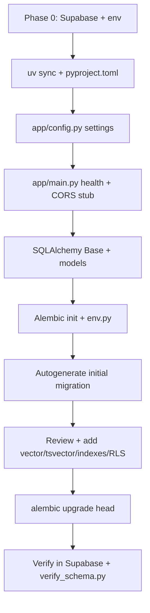

# Phase 1 implementation plan — backend scaffold & database

Establish the FastAPI backend shell and migrate the full Postgres schema to Supabase before any auth, chat, or ingestion features.

Reference: [docs/todos.md](../docs/todos.md) · [docs/architecture.md](../docs/architecture.md) · [docs/guides/backend-setup.md](../docs/guides/backend-setup.md) · [docs/guides/supabase-setup.md](../docs/guides/supabase-setup.md)

**Status:** Complete (retrospective — reflects what is configured in the repo today).

---

## Goal

Deliver a running backend with a **reviewed, applied Alembic migration** that creates every table Phase 4–7 will need:

**`uv sync` → FastAPI health check → SQLAlchemy models → Alembic migration → `upgrade head` on Supabase → verify tables**

After Phase 1, the database contract is fixed: chat, corpus, embeddings, citations, and RLS policies all exist — even though no product routes use them yet.

---

## Prerequisites (Phase 0)

Complete before Phase 1:

| Item | Notes |
|------|-------|
| Python 3.12+ | Pin in repo root `.python-version` |
| [uv](https://docs.astral.sh/uv/) | Backend dependency management |
| Supabase project | [supabase-setup.md](../docs/guides/supabase-setup.md) |
| `backend/.env` | From `backend/.env.example` — URL, keys, **direct** `DATABASE_URL` |
| OpenAI key in `.env` | Required by `app/config.py` at startup (used in Phases 4–6) |

---

## Current state (at Phase 1 start)

| Area | Status |
|------|--------|
| `backend/` | Empty or minimal — no `app/` package |
| Supabase | Project created; **no app tables** yet |
| Frontend | Not started (Phase 2) |
| Alembic | Not initialized |

---

## Build order (dependency graph)



**Rule:** Do not hand-edit production tables in the Supabase dashboard. Alembic is the source of truth.

---

## Step 1 — Backend project bootstrap

### Checklist

- [x] `cd backend && uv sync` with dependencies per [backend-setup.md](../docs/guides/backend-setup.md)
- [x] `pyproject.toml` — hatchling wheel for editable `app/` install (`from app...` works everywhere)
- [x] Python 3.12+ in `requires-python`

### Core dependencies (pinned in `backend/pyproject.toml`)

| Package | Purpose |
|---------|---------|
| `fastapi`, `uvicorn` | HTTP API |
| `pydantic`, `pydantic-settings` | Settings + request models |
| `sqlalchemy`, `alembic`, `psycopg[binary]` | ORM + migrations |
| `pgvector` | SQLAlchemy `Vector` type for embeddings |
| `supabase`, `httpx`, `openai` | Reserved for Phases 2–6 |
| `structlog`, `pydantic-ai` | Reserved for Phases 6–8 |

Dev: `pytest`, `ruff`, `ipykernel`.

---

## Step 2 — Configuration (`app/config.py`)

Single settings module — **fail fast** on missing env vars.

### Required env vars (`backend/.env.example`)

| Variable | Purpose |
|----------|---------|
| `SUPABASE_URL` | Project URL |
| `SUPABASE_ANON_KEY` | Public anon key |
| `SUPABASE_SERVICE_ROLE_KEY` | Backend-only privileged client |
| `DATABASE_URL` | **Direct** Postgres host (`db.<ref>.supabase.co`) — not pooler |
| `OPENAI_API_KEY` | Validated at startup |
| `OPENAI_EMBEDDING_MODEL` | Default `text-embedding-3-small` |
| `OPENAI_EMBEDDING_DIMENSIONS` | Default `1536` |
| `ALLOWED_ORIGINS` | CORS — default `http://localhost:5173` |

### Validators (implemented)

- Reject empty `DATABASE_URL`
- Reject transaction pooler URL (`pooler.supabase.com`)
- Require direct Supabase host (`db.<ref>.supabase.co`)
- Ensure Supabase project ref matches between `SUPABASE_URL` and `DATABASE_URL`

### Checklist

- [x] `settings = Settings()` singleton
- [x] No `os.getenv` elsewhere in app code

---

## Step 3 — FastAPI entrypoint (`app/main.py`)

Minimal app for Phase 1:

- [x] `FastAPI(title="Document Copilot")`
- [x] CORS middleware from `settings.allowed_origins`
- [x] `GET /health` → `{ "status": "ok" }` (no auth)

Phase 2 adds `GET /me`. Phase 3 adds `/chat/*` routes.

```powershell
cd backend
uv run uvicorn app.main:app --reload
# curl http://localhost:8000/health
```

---

## Step 4 — SQLAlchemy models

Location: `backend/app/database/`

```text
app/database/
├── base.py              # DeclarativeBase
├── models/
│   ├── __init__.py      # Re-exports all models for Alembic
│   ├── user.py
│   ├── source_document.py
│   ├── document_chunk.py
│   ├── chat_thread.py
│   ├── chat_message.py
│   └── message_citation.py
```

### Table summary

| Table | Purpose | Key constraints |
|-------|---------|-----------------|
| `users` | App profile row per Supabase auth user | PK = `auth.users.id` |
| `source_documents` | One row per SEC filing (Markdown + metadata) | Unique `accession_number` |
| `document_chunks` | Retrieval passages + embedding | Unique `stable_chunk_id`; FK → document |
| `chat_threads` | User-owned conversations | FK → `users`; RLS by `user_id` |
| `chat_messages` | Ordered messages per thread | FK → thread; `sequence_number` |
| `message_citations` | Normalized citations on assistant messages | FK → message + chunk |

### `document_chunks` columns (retrieval-critical)

| Column | Notes |
|--------|-------|
| `embedding` | `vector(1536)` via `pgvector.sqlalchemy.Vector` |
| `search_vector` | **Not in SQLAlchemy model** — added in migration as generated `tsvector` |
| `stable_chunk_id` | Citation anchor — globally unique |
| `chunk_metadata` | JSONB — ticker, section, offsets, etc. |

Import all models in `alembic/env.py` so autogenerate sees metadata:

```python
import app.database.models  # noqa: F401
target_metadata = Base.metadata
```

---

## Step 5 — Alembic setup

### Checklist

- [x] `uv run alembic init alembic`
- [x] `alembic/env.py` reads `settings.database_url`, converts to `postgresql+psycopg://`
- [x] `alembic upgrade head` uses direct session connection (NullPool)

### Generate initial migration

```powershell
cd backend
uv run alembic revision --autogenerate -m "initial schema"
```

**Always review** the generated file — autogenerate will **not** infer:

---

## Step 6 — Manual migration additions

File: `backend/alembic/versions/ab03722082e4_initial_schema.py`

Add explicit `op.execute(...)` for:

### Extensions & generated columns

- [x] `create extension if not exists vector`
- [x] Generated `search_vector` on `document_chunks`:

```sql
alter table document_chunks
add column search_vector tsvector
generated always as (to_tsvector('english', coalesce(chunk_text, ''))) stored
```

### Indexes

- [x] HNSW on `document_chunks.embedding` (`vector_cosine_ops`)
- [x] GIN on `document_chunks.search_vector`
- [x] GIN on `document_chunks.chunk_metadata` (jsonb)

### Auth sync trigger

- [x] `handle_new_user()` — inserts into `public.users` on `auth.users` insert
- [x] Trigger `on_auth_user_created`

Required so chat thread FK to `users.id` succeeds when analysts are added via Supabase dashboard.

### Row-level security

Enable RLS on all six tables, then policies:

| Table | Policy |
|-------|--------|
| `users` | Select/update own row (`auth.uid() = id`) |
| `source_documents` | Select for all `authenticated` |
| `document_chunks` | Select for all `authenticated` |
| `chat_threads` | All ops where `auth.uid() = user_id` |
| `chat_messages` | All ops when parent thread belongs to `auth.uid()` |
| `message_citations` | All ops when parent message's thread belongs to user |

Corpus tables are **read-only for analysts**; Phase 4 ingest writes via service role.

---

## Step 7 — Apply and verify

```powershell
cd backend
uv run alembic upgrade head
uv run python scripts/verify_schema.py
```

### `scripts/verify_schema.py` checks

- All six expected tables exist
- `vector` extension installed
- `document_chunks` has `embedding` and `search_vector` columns
- HNSW/GIN indexes present
- RLS enabled on public tables

### Supabase dashboard (read-only)

- Table Editor shows all tables
- Do **not** treat dashboard edits as schema changes

---

## File checklist (Phase 1)

### Created

- [x] `.python-version` — `3.12`
- [x] `backend/pyproject.toml`, `backend/uv.lock`
- [x] `backend/app/config.py`
- [x] `backend/app/main.py`
- [x] `backend/app/database/base.py`
- [x] `backend/app/database/models/*.py`
- [x] `backend/alembic/` + `alembic.ini`
- [x] `backend/alembic/versions/ab03722082e4_initial_schema.py`
- [x] `backend/scripts/verify_schema.py`
- [x] `backend/.env.example`

### Not in scope yet

- Auth dependencies, Supabase client factories (Phase 2)
- Chat routes (Phase 3)
- Ingest scripts (Phase 4)

---

## Manual pass

| Step | Action | Expected |
|------|--------|----------|
| 1 | Copy `backend/.env.example` → `.env`, fill Supabase + OpenAI values | App starts without settings errors |
| 2 | `uv run alembic upgrade head` | Migration succeeds on direct DB URL |
| 3 | `uv run python scripts/verify_schema.py` | No missing tables; vector + indexes reported |
| 4 | `uv run uvicorn app.main:app --reload` | Server starts |
| 5 | `curl http://localhost:8000/health` | `{"status":"ok"}` |
| 6 | Supabase Table Editor | Six app tables visible; RLS enabled |

**Failure signals:**

- Migration fails on pooler URL → switch to `db.<ref>.supabase.co`
- `vector` extension error → ensure `create extension` op is in migration
- Project ref mismatch → align `SUPABASE_URL` and `DATABASE_URL`

---

## Definition of done (Phase 1)

- [x] Backend installs and runs with `uv sync` + uvicorn
- [x] `GET /health` responds without database access
- [x] All SQLAlchemy models committed
- [x] Initial Alembic migration reviewed and applied to Supabase
- [x] pgvector, generated `tsvector`, HNSW, and GIN indexes in place
- [x] RLS policies and `handle_new_user` trigger applied
- [x] Schema verification script passes

---

## What later phases reuse unchanged

| Phase | Reuses from Phase 1 |
|-------|---------------------|
| 2 | Same tables; adds JWT verification against Supabase |
| 3 | `chat_threads`, `chat_messages` via user-scoped client |
| 4 | `source_documents`, `document_chunks` for ingest upserts |
| 5 | `embedding`, `search_vector` indexes for hybrid search |
| 6–7 | `message_citations` FK to chunks |

Schema changes after Phase 1 require a **new Alembic revision** — never dashboard-only edits.

---

## Suggested work split (solo, ~2–3 days)

| Day | Focus |
|-----|-------|
| 1 | uv project, config, main, Base + user/chat models |
| 2 | Corpus + citation models; Alembic init; autogenerate migration |
| 3 | Review migration (vector, tsvector, indexes, RLS, trigger); apply; verify |

---

## Architecture references

From [architecture.md](../docs/architecture.md):

- Schema source of truth: Alembic, not Supabase dashboard
- Direct `DATABASE_URL` for migrations; pooler is for app runtime only (future)
- `source_documents.markdown_content` stores normalized filing text for re-chunking
- Hybrid retrieval (Phase 5) queries `document_chunks.embedding` + `search_vector`
