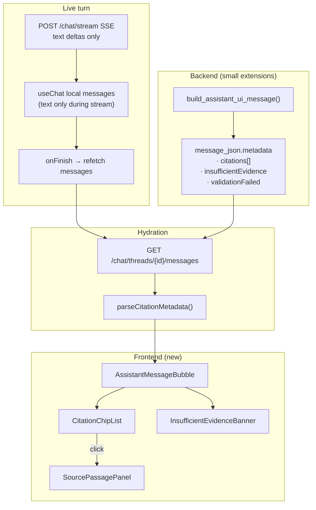

# Phase 7 — Citations UI & analyst polish

**Goal:** Turn persisted grounded answers into a trust-building analyst experience — citation chips with filing context, one-click passage verification, and clear “not in corpus” messaging.

Related: [docs/todos.md](../docs/todos.md) (Phase 7) · [docs/client-brief.md](../docs/client-brief.md) · [phase-six-implementation-plan.md](phase-six-implementation-plan.md) · [phase-six-testing-plan.md](phase-six-testing-plan.md)

**Prerequisite:** Phase 6 complete — `POST /chat/stream` persists `message_json.metadata.citations` (camelCase) and `message_citations` rows on successful grounding.

---

## What Phase 7 delivers

| User story | Acceptance |
|------------|------------|
| See where each claim comes from | Assistant messages show citation chips: company, filing type, fiscal year, section/page |
| Verify in one click | Clicking a chip opens a passage panel with quoted excerpt + full chunk text + SEC source link |
| Trust refusals | Answers with insufficient corpus evidence show distinct “not in corpus” styling — not fake citations |
| Survive refresh | Citations render from `GET /chat/threads/{id}/messages` history, not only live stream |
| End-to-end manual pass | Sign in → real question → streamed answer → click citation → read passage |

---

## Current state (gap analysis)

### Already built (Phase 6 backend)

- `build_citation_ui_metadata()` in `app/chat/messages.py` — camelCase fields per citation:
  - `chunkId`, `stableChunkId`, `claimIndex`, `excerpt`
  - `ticker`, `companyName`, `filingType`, `fiscalYear`
  - `sectionLabel`, `pageLabel`, `sourceUrl`, `accessionNumber`
- Persisted on successful grounded turns in `message_json.metadata.citations`
- `message_citations` table for audit (UI reads `message_json` for v1)

### Not built yet (Phase 7 scope)

| Gap | Impact |
|-----|--------|
| Frontend ignores `metadata` on `UIMessage` | No citation chips or passage panel |
| SSE streams text only — no citation metadata mid-stream | Citations appear only after post-stream hydration |
| `ChatPanel.onFinish` refetches threads, not messages | Streamed assistant bubble lacks citations until page reload |
| `insufficient_evidence` not in `message_json` | UI cannot distinguish honest refusal vs grounded answer |
| UI metadata has `excerpt` only, not full `chunk_text` | “Verify passage” panel cannot show full underlying text without backend extension |
| Empty state copy still mentions “stubbed reply” | Misleading after Phase 6 |
| No `page_label` from ingest (always `null`) | UI should fall back gracefully to section label |

---

## Architecture



**Design choice (v1):** Do **not** add new SSE event types. Hydrate citation metadata by refetching thread messages when the stream finishes, then merge metadata into the last assistant message. Simpler, matches Phase 6 contract, avoids AI SDK transport changes.

---

## Implementation checklist

### A — Types & parsing (frontend)

- [ ] Extend `src/lib/chat-types.ts` with `CitationMetadata`, `AssistantMessageMetadata`
- [ ] Add `src/lib/citations.ts` — `getAssistantMetadata(message)`, `formatCitationLabel(citation)`, type guards
- [ ] Parse `message.metadata` from AI SDK `UIMessage` (unknown → narrow safely)

### B — Backend metadata extensions (small)

- [ ] Extend `build_assistant_ui_message()` to set:
  - `metadata.insufficientEvidence: bool` from `GroundedAnswer.insufficient_evidence`
  - `metadata.validationFailed: bool` when orchestrator substitutes grounding fallback
  - `metadata.citations[].passageText: str` from `SourcePassage.chunk_text` (full chunk for panel)
- [ ] Unit test in `tests/chat/test_messages_citations.py` for new fields
- [ ] Keep DB `citation_metadata` unchanged (snake_case); UI-only `passageText` in `message_json`

### C — Citation chips (frontend)

- [ ] `src/components/chat/CitationChip.tsx` — compact chip: `{companyName} · {filingType} FY{fiscalYear} · {sectionLabel ?? 'Section'}`
- [ ] `src/components/chat/CitationChipList.tsx` — numbered list below assistant answer; `claimIndex` ordering
- [ ] Optional SEC link icon using `sourceUrl` (opens in new tab)

### D — Source passage panel (frontend)

- [ ] `src/components/chat/SourcePassagePanel.tsx` — slide-over or collapsible card (shadcn `Sheet` or bordered expand)
- [ ] Selected citation state in `AssistantMessageBubble` or `ChatPanel`
- [ ] Panel shows:
  - Filing header (company, ticker, fiscal year, accession)
  - Section / page labels (with “not specified” fallback)
  - **Excerpt** (highlighted / blockquote) — the grounded quote
  - **Full passage** (`passageText`) — scrollable
  - “View on SEC EDGAR” link (`sourceUrl`)

### E — Insufficient evidence UX (frontend)

- [ ] `src/components/chat/TrustStatusBanner.tsx` (or inline in assistant bubble)
- [ ] When `metadata.insufficientEvidence === true` and no citations:
  - Amber/info banner: “Not enough evidence in the curated filings to answer this confidently.”
  - No citation chips rendered
- [ ] When `metadata.validationFailed === true`:
  - Distinct message: “Could not verify citations for this answer.” (matches backend fallback)
- [ ] Do not treat empty citations on otherwise normal answers as refusal (defensive)

### F — Message rendering & stream hydration (frontend)

- [ ] Split `MessageBubble` → keep user bubble; add `AssistantMessageBubble` for assistant role
- [ ] `ChatPanel`: on `onFinish`, call `getThreadMessages(threadId)` and patch last assistant message metadata into `useChat` state (or remount with fresh `initialMessages` via key bump + state lift)
- [ ] Update `MessageList` to use `AssistantMessageBubble` for `role === 'assistant'`
- [ ] Update empty state copy in `ChatPanel` — remove stub language; suggest example questions from client brief

### G — Polish & accessibility

- [ ] Keyboard: citation chips focusable; Enter opens panel
- [ ] `aria-label` on chips (“Citation 1: NVIDIA 10-K FY2024, Item 1”)
- [ ] Mobile: passage panel full-width sheet
- [ ] `pnpm tsc --noEmit` + `pnpm lint` clean

### H — Manual pass (definition of done)

- [ ] Sign in → ask “For Amazon, what did the filing say about AWS operating margin?”
- [ ] Streamed answer completes → citation chips appear without manual refresh
- [ ] Click citation → passage panel shows excerpt + full text + SEC link
- [ ] Ask “Do the filings prove generative AI improved margins?” → insufficient-evidence banner, no chips
- [ ] Refresh page → citations and banners still correct from history

---

## How to implement (step order)

Build in this order to keep each step demoable.

### Step 1 — Backend metadata (≈1 hour)

**Files:** `backend/app/chat/messages.py`, `backend/app/chat/streaming.py` (pass flags through), `backend/tests/chat/test_messages_citations.py`

```python
# build_assistant_ui_message() — extend metadata block
message["metadata"] = {
    "insufficientEvidence": insufficient_evidence,
    "validationFailed": validation_failed,
    "citations": [...],  # each citation gains passageText
}
```

Wire `validation_failed` from `TurnResult` in `assistant_message_json()` / `_persist_turn_result`.

### Step 2 — Frontend types + parser (≈30 min)

**Files:** `frontend/src/lib/chat-types.ts`, `frontend/src/lib/citations.ts`

Define:

```typescript
export type CitationMetadata = {
  chunkId: string
  stableChunkId: string
  claimIndex: number
  excerpt: string
  passageText?: string
  ticker: string
  companyName: string
  filingType: string
  fiscalYear: number
  sectionLabel: string | null
  pageLabel: string | null
  sourceUrl: string
  accessionNumber: string
}

export type AssistantMessageMetadata = {
  citations?: CitationMetadata[]
  insufficientEvidence?: boolean
  validationFailed?: boolean
}
```

### Step 3 — Citation chips + passage panel (≈2–3 hours)

**Files:** new components under `frontend/src/components/chat/`

- Install shadcn sheet if needed: `pnpm dlx shadcn@latest add sheet`
- Compose chips + panel without stream hydration first (test against hard-coded metadata or loaded history)

### Step 4 — Assistant message bubble (≈1 hour)

**Files:** `AssistantMessageBubble.tsx`, update `MessageList.tsx`

Render: answer text → `TrustStatusBanner` (if applicable) → `CitationChipList`

### Step 5 — Post-stream hydration (≈1–2 hours)

**Files:** `ChatPanel.tsx`, possibly lift message state to `ChatPage.tsx`

Recommended pattern:

```typescript
onFinish: async () => {
  onStreamComplete?.()  // refetch thread list
  const fresh = await getThreadMessages(threadId)
  // Merge metadata from last assistant message in `fresh` into useChat messages
  // Option A: setMessages from useChat if exposed
  // Option B: bump remount key on ThreadChatView with updated initialMessages
}
```

Verify `useChat` from `@ai-sdk/react` exposes `setMessages` — if not, lift state: parent holds `messages`, passes to `useChat` as controlled `messages` + `setMessages` callback.

### Step 6 — Copy polish + manual QA (≈1 hour)

Update empty state, run full manual pass checklist (Section H).

---

## File map (expected)

```
frontend/src/
├── lib/
│   ├── chat-types.ts          # + AssistantMessageMetadata
│   └── citations.ts           # NEW — parse & format helpers
├── components/chat/
│   ├── MessageBubble.tsx      # user messages only (or thin wrapper)
│   ├── AssistantMessageBubble.tsx   # NEW
│   ├── CitationChip.tsx             # NEW
│   ├── CitationChipList.tsx         # NEW
│   ├── SourcePassagePanel.tsx       # NEW
│   ├── TrustStatusBanner.tsx        # NEW
│   ├── ChatPanel.tsx          # hydration + empty state
│   └── MessageList.tsx        # route assistant → AssistantMessageBubble

backend/app/chat/
└── messages.py                # metadata extensions
```

---

## Explicitly out of scope (Phase 7)

| Item | Deferred to |
|------|-------------|
| Inline `[1]` superscripts inside answer prose | Optional v1.1 |
| New `GET /chunks/{id}` API | Only if `passageText` in metadata is too large — prefer metadata first |
| Citation metadata in SSE stream events | v2 — refetch-on-finish is sufficient |
| `structlog`, deploy, pilot | Phases 8–9 |
| Frontend unit / E2E test runner | Project policy — manual + `tsc`/`lint` only |

---

## Risks & mitigations

| Risk | Mitigation |
|------|------------|
| Large `chunk_text` bloats `message_json` | Cap `passageText` at 4–8 KB in `build_citation_ui_metadata` with “truncated” flag if needed |
| `useChat` won't merge refetched metadata | Lift message state to parent or use `setMessages` after refetch |
| `page_label` always null from ingest | UI shows section label; omit page when null |
| Grounding fallback looks like refusal | Separate `validationFailed` vs `insufficientEvidence` banners |

---

## Phase 7 → Phase 8 handoff

When Phase 7 is done:

- Analysts can visually verify citations before trusting answers
- Client-brief Q10 refusal is obvious in the UI
- Phase 8 can run the full example-question set with UI-visible citation quality checks
