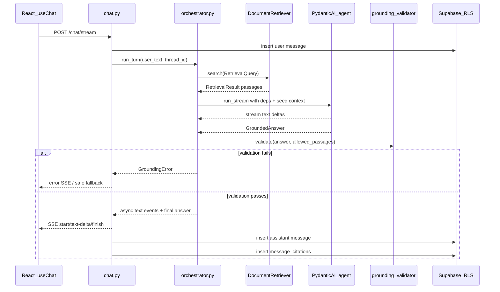
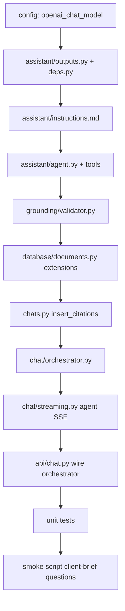

# Phase 6 implementation plan — LLM agent, grounding & real chat stream

Replace the Phase 3 chat stub with a grounded PydanticAI agent so analysts get streamed, cited answers from the ingested corpus.

Reference: [docs/todos.md](../docs/todos.md) · [docs/architecture.md](../docs/architecture.md) · [docs/client-brief.md](../docs/client-brief.md) · [phase-five-implementation-plan.md](phase-five-implementation-plan.md) · [phase-five-testing-plan.md](phase-five-testing-plan.md)

**Status:** Plan only — implement after review.

---

## Goal

Deliver a full backend chat turn:

**POST /chat/stream → retrieve → PydanticAI agent → validate citations → SSE text stream → persist message + message_citations**

Analyst sends a question → backend returns a **streamed, cited answer** grounded in retrieved SEC passages, or an honest **"not enough evidence"** response. Every persisted citation maps to a chunk that was retrieved during that turn.

Phase 6 is **backend-only**. The existing frontend (`frontend/src/components/chat/ChatPanel.tsx`) continues to render streamed text; citation UI ships in Phase 7.

---

## Current state (as of Phase 5 complete)

| Area | Status |
|------|--------|
| Retrieval | `backend/app/retrieval/` — `DocumentRetriever`, `SourcePassage`, hybrid search + RRF |
| Corpus DB reads | `backend/app/database/documents.py` — chunk/document fetch + neighbors |
| Chat stub | `backend/app/api/chat.py` + `backend/app/chat/streaming.py` — fake reply, no OpenAI |
| Persistence | `backend/app/database/chats.py` — threads/messages via user-scoped Supabase; **no citation writes yet** |
| Schema | `message_citations` table + RLS exist (`backend/alembic/versions/ab03722082e4_initial_schema.py`) |
| PydanticAI | In deps (`backend/pyproject.toml` `pydantic-ai==1.104.0`) but unused |
| Config | Embedding settings only — **no chat model setting yet** |
| Frontend | `useChat` → `POST /chat/stream`; displays text parts only |

---

## End-to-end turn flow



**Fail-closed rule:** If grounding validation fails, do **not** persist a polished unsupported answer. Return a controlled error or a safe fallback message.

---

## Pattern: responsibilities by module

| Module | Owns |
|--------|------|
| `chat/orchestrator.py` | One turn lifecycle, turn-scoped retrieved passage registry |
| `assistant/agent.py` | PydanticAI agent, tools, model call |
| `assistant/deps.py` | `DocumentAgentDeps` dataclass |
| `assistant/outputs.py` | `GroundedAnswer`, `Citation` (re-export `SourcePassage` from retrieval) |
| `assistant/instructions.md` | Product contract prompt |
| `grounding/validator.py` | Citation ↔ passage enforcement (testable without LLM) |
| `chat/streaming.py` | SSE mapping for real agent stream (keep stub helpers for tests) |
| `database/chats.py` | Extend with `insert_citations()` |
| `database/documents.py` | Extend with `fetch_chunk_by_stable_id`, `fetch_chunk_by_id` |

Retrieval stays independent from PydanticAI per [architecture.md](../docs/architecture.md).

---

## Build order



**Rule:** Build and test `grounding/validator.py` before wiring the live LLM — same discipline as Phase 5 fusion tests.

**Rule:** Keep existing AI SDK event order: `start` → `text-start` → `text-delta*` → `text-end` → `finish` → `[DONE]` (`backend/tests/chat/test_streaming.py`).

**Rule:** Do not wire citation UI in Phase 6. Persist citation metadata in `message_json` for Phase 7.

---

## Target module layout

```text
backend/app/
├── config.py                         # add openai_chat_model, agent timeouts
├── assistant/
│   ├── __init__.py
│   ├── deps.py                       # DocumentAgentDeps
│   ├── outputs.py                    # GroundedAnswer, Citation
│   ├── agent.py                      # PydanticAI Agent + tools
│   └── instructions.md
├── grounding/
│   ├── __init__.py
│   └── validator.py                  # GroundingValidator
├── chat/
│   ├── orchestrator.py               # NEW — TurnContext, run_turn()
│   ├── streaming.py                  # agent SSE + keep stub path for tests
│   └── messages.py                   # build_assistant_ui_message with citations
└── database/
    ├── documents.py                  # extend read helpers
    └── chats.py                      # insert_citations()

backend/scripts/
└── smoke_agent.py                    # client-brief questions via DocumentRetriever + agent
```

---

## Step 1 — Configuration (`app/config.py`)

Add chat model settings (env-overridable):

| Setting | Default | Purpose |
|---------|---------|---------|
| `openai_chat_model` | `gpt-4o-mini` | PydanticAI generation model |
| `openai_chat_timeout_seconds` | `120` | Per-turn upstream timeout |
| `agent_max_tool_calls` | `5` | Cap tool loops per turn |

Reuse existing `OPENAI_API_KEY`. Do not add a second embedding model.

Update `backend/.env.example` with the new vars.

---

## Step 2 — Assistant types (`app/assistant/outputs.py`)

```python
class Citation(BaseModel):
    chunk_id: UUID              # must exist in document_chunks
    stable_chunk_id: str        # citation anchor from ingest
    claim_index: int            # order in answer (0-based)
    excerpt: str                # supporting quote from passage

class GroundedAnswer(BaseModel):
    answer: str
    citations: list[Citation]
    insufficient_evidence: bool = False  # explicit refusal path
```

- Re-export `SourcePassage`, `DocumentSummary` from `app/retrieval/schemas.py` — single source of truth.
- `insufficient_evidence=True` relaxes "must have citation" when the corpus cannot support an answer (client-brief Q10).

---

## Step 3 — Agent dependencies (`app/assistant/deps.py`)

```python
@dataclass
class DocumentAgentDeps:
    user_id: str
    thread_id: str
    retriever: DocumentRetriever
    retrieved_passages: dict[UUID, SourcePassage]  # mutable turn registry
    grounding_validator: GroundingValidator
```

`retrieved_passages` is populated by:

1. Orchestrator seeding from initial `DocumentRetriever.search()`
2. Agent tool `search_filings` adding new passages

All citations must reference `chunk_id` keys in this registry.

---

## Step 4 — System instructions (`app/assistant/instructions.md`)

Encode the product contract from [architecture.md](../docs/architecture.md) and [client-brief.md](../docs/client-brief.md):

- Answer **only** from retrieved passages provided or returned by tools
- Cite every factual claim with `chunk_id` + short `excerpt`
- If passages are insufficient, set `insufficient_evidence=true` and explain what is missing
- No stock recommendations or investment advice
- Concise analyst-ready prose; no invented filing metadata
- Corpus scope: 10-K filings for AAPL, AMZN, GOOGL, MSFT, NVDA (2021–2025)

Load via `Path(__file__).parent / "instructions.md"` in `agent.py`.

---

## Step 5 — PydanticAI agent + bounded tools (`app/assistant/agent.py`)

### Agent definition

- `Agent(model=settings.openai_chat_model, deps_type=DocumentAgentDeps, output_type=GroundedAnswer)`
- System prompt from `instructions.md`
- User prompt: analyst question + formatted seed passages from orchestrator

### Bounded tools (no agent-generated SQL)

| Tool | Behavior |
|------|----------|
| `search_filings(query, tickers?, fiscal_years?)` | Calls `DocumentRetriever.search(RetrievalQuery(...))`; merges passages into `deps.retrieved_passages`; returns compact passage summaries |
| `read_chunk(stable_chunk_id)` | `documents.fetch_chunk_by_stable_id()`; register passage if not already present |
| `read_surrounding_chunks(stable_chunk_id)` | Fetch center chunk + neighbors (reuse `fetch_neighbor_chunks`) |

Tool return shapes should be **compact** (ticker, fiscal year, section, truncated text) to limit tokens.

### v1 orchestration strategy

**Recommended:** Orchestrator runs initial hybrid retrieval before the agent call and injects top passages into the prompt. Tools remain for follow-up reads — avoids burning tool calls on every turn.

---

## Step 6 — Grounding validator (`app/grounding/validator.py`)

Pure, testable enforcement:

```python
class GroundingValidator:
    def validate(
        self,
        answer: GroundedAnswer,
        allowed_passages: dict[UUID, SourcePassage],
    ) -> None:  # raises GroundingValidationError
```

**Invariants:**

| Rule | Enforcement |
|------|-------------|
| Citation chunk exists | Every `citation.chunk_id` in `allowed_passages` |
| Excerpt grounded | `excerpt` is a substring of passage `chunk_text` — whitespace-normalized compare |
| No citations when refusing | If `insufficient_evidence`, `citations` must be empty |
| Citations required otherwise | If not `insufficient_evidence`, `citations` non-empty |
| Stable ID consistency | `citation.stable_chunk_id` matches passage record |

On failure: raise `GroundingValidationError` with structured reason (orchestrator maps to user-safe message).

---

## Step 7 — Extend corpus read helpers (`app/database/documents.py`)

Add to existing Phase 5 module:

| Function | Purpose |
|----------|---------|
| `fetch_chunk_by_id(session, chunk_id)` | Single chunk hydration for `read_chunk` tool |
| `fetch_chunk_by_stable_id(session, stable_chunk_id)` | Lookup by ingest anchor |
| `chunk_row_to_source_passage(session, chunk_row)` | Optional helper to build `SourcePassage` with document metadata |

These wrap existing SQL patterns — no schema migration.

---

## Step 8 — Citation persistence (`app/database/chats.py`)

Add:

```python
def insert_citations(
    client: Client,
    message_id: UUID,
    citations: list[CitationRecord],
) -> None:
```

`CitationRecord` fields map to `message_citations`:

| DB column | Source |
|-----------|--------|
| `message_id` | persisted assistant message UUID |
| `chunk_id` | `Citation.chunk_id` |
| `claim_index` | `Citation.claim_index` |
| `excerpt` | `Citation.excerpt` |
| `citation_metadata` | JSON: `{ ticker, company_name, fiscal_year, filing_type, section_label, page_label, source_url, stable_chunk_id }` from `SourcePassage` |

RLS: `message_citations_all_own` policy already scopes via parent thread ownership.

**Note:** `insert_message` currently generates a new UUID server-side. Phase 6 must use a **pre-assigned assistant message id** (same pattern as stub's `assistant_id`) so citations FK resolves correctly. Refactor `insert_message` to accept optional `message_id: UUID | None`.

---

## Step 9 — Turn orchestrator (`app/chat/orchestrator.py`)

```python
@dataclass
class TurnResult:
    answer: GroundedAnswer
    passages: list[SourcePassage]
    message_id: str

async def run_turn(
    *,
    user_text: str,
    thread_id: UUID,
    user_id: str,
    retriever: DocumentRetriever,
    validator: GroundingValidator,
) -> TurnResult:
```

Steps:

1. `retrieval = retriever.search(RetrievalQuery(text=user_text))`
2. Build `retrieved_passages: dict[UUID, SourcePassage]` from `retrieval.passages`
3. Construct `DocumentAgentDeps`
4. `async with agent.run_stream(prompt, deps=deps) as result:` collect text stream + final `GroundedAnswer`
5. `validator.validate(answer, retrieved_passages)`
6. Return `TurnResult`

Handle empty retrieval: still invoke agent with explicit "no passages retrieved" context so it can set `insufficient_evidence`.

---

## Step 10 — Real streaming (`app/chat/streaming.py`)

Add `stream_agent_turn()` parallel to existing `stream_stub_turn()`:

- Reuse `format_sse_event`, `STREAM_HEADERS`, direct delta passthrough
- Stream **text deltas live** from PydanticAI `run_stream` (not post-hoc chunking of full answer)
- After stream completes and validation passes, build `message_json` via extended `build_assistant_ui_message()`

### Citation payload in `message_json` (Phase 7 prep)

Extend assistant UI message shape:

```json
{
  "id": "msg_...",
  "role": "assistant",
  "parts": [{"type": "text", "text": "..."}],
  "metadata": {
    "citations": [
      {
        "chunkId": "...",
        "stableChunkId": "...",
        "claimIndex": 0,
        "excerpt": "...",
        "ticker": "AMZN",
        "fiscalYear": 2024,
        "sectionLabel": "Item 7",
        "sourceUrl": "..."
      }
    ]
  }
}
```

Frontend ignores `metadata` in Phase 6; Phase 7 reads it for citation UI. No new SSE event types required for v1.

Keep stub functions for existing unit tests.

---

## Step 11 — Wire API route (`app/api/chat.py`)

Replace stub block in `post_chat_stream`:

1. Keep: auth, thread check, user message persist, title update
2. Replace: `build_stub_reply` / `stream_stub_turn` with `run_turn` + `stream_agent_turn`
3. On success `on_complete`: persist assistant `content_text` + `message_json` + `insert_citations`
4. On `GroundingValidationError`: log + stream safe fallback text **without** citation rows
5. On OpenAI/retrieval errors: 502 with existing error pattern

Inject dependencies via FastAPI `Depends` factories:

```python
def get_document_retriever() -> DocumentRetriever: ...
def get_grounding_validator() -> GroundingValidator: ...
```

---

## Testing plan

### Unit tests (no OpenAI)

| File | Coverage |
|------|----------|
| `tests/grounding/test_validator.py` | Valid citations pass; unknown chunk_id fails; bad excerpt fails; insufficient_evidence rules |
| `tests/assistant/test_outputs.py` | `GroundedAnswer` / `Citation` schema validation |
| `tests/chat/test_messages.py` | `build_assistant_ui_message` includes citation metadata |
| `tests/chat/test_orchestrator.py` | Mocked agent + retriever; validator called; empty retrieval path |

### Integration / smoke (requires OpenAI + Supabase)

| Script | Purpose |
|--------|---------|
| `backend/scripts/smoke_agent.py` | Run 3–5 client-brief questions end-to-end; print answer + citation count |
| Manual via UI | Sign in → ask "AWS operating margin" → see real streamed answer (text only) |

Prioritize client-brief questions **#2, #3, #10** for smoke (AMZN/AWS, NVDA Data Center, refusal case).

### Regression

- `uv run pytest -v` — all existing chat route tests updated to mock orchestrator instead of stub
- Phase 5 retrieval tests unchanged

---

## Definition of done (Phase 6)

- [ ] `app/assistant/` — agent, deps, outputs, instructions
- [ ] Agent tools: `search_filings`, `read_chunk`, `read_surrounding_chunks`
- [ ] `app/grounding/validator.py` — fail-closed citation enforcement
- [ ] `app/chat/orchestrator.py` — one turn end-to-end
- [ ] `app/chat/streaming.py` — real agent SSE (same event shape as stub)
- [ ] `app/database/chats.py` — `insert_citations`; optional `message_id` on insert
- [ ] `app/database/documents.py` — chunk lookup helpers for tools
- [ ] `POST /chat/stream` returns real cited answers (text visible in UI)
- [ ] Assistant message + `message_citations` persisted after successful runs
- [ ] Unit tests: grounding, citation persistence shape, orchestrator mocks
- [ ] Smoke: client-brief questions return cited answers or honest refusal
- [ ] No Phase 7 citation UI changes required for Phase 6 done

---

## Explicitly out of scope (Phase 6)

| Item | Deferred to |
|------|-------------|
| Citation UI, passage panel, click-to-verify | Phase 7 |
| `structlog` structured logging | Phase 8 |
| Cross-encoder reranker | Optional retrieval tuning |
| FastAPI retrieval debug routes | Not needed |
| Thread delete/rename | Future |
| Frontend changes (unless stream breaks) | Fix-only |
| Railway deploy | Phase 9 |

---

## What Phase 7 reuses

- `message_json.metadata.citations` for rendering
- `GET /chat/threads/{id}/messages` — hydrate citation chips from persisted metadata
- `message_citations` table for server-side citation history / audit
- `SourcePassage` shape for expandable passage panel

---

## What Phase 6 reuses from Phase 5 (unchanged)

| Phase 5 deliverable | Phase 6 usage |
|---------------------|---------------|
| `DocumentRetriever.search()` | Orchestrator initial retrieval + `search_filings` tool |
| `SourcePassage`, `RetrievalQuery` | Agent context + grounding validator input |
| `app/database/documents.py` | Tool helpers for `read_chunk` / neighbors |
| `app/database/engine.py` | Direct Postgres reads inside tools |
| `scripts/smoke_retrieval.py` | Regression check before agent work |

No re-ingest required unless corpus or embedding model changes.

---

## Suggested work split (solo, ~3–4 days)

| Day | Focus |
|-----|-------|
| 1 | `outputs`, `deps`, `instructions`, `validator` + unit tests |
| 2 | `agent.py` tools, `documents.py` extensions, manual agent smoke in script |
| 3 | `orchestrator`, `streaming`, `chats.insert_citations`, wire `chat.py` |
| 4 | Update API tests, `smoke_agent.py`, manual UI pass, client-brief spot-check |

---

## Open decisions (resolve before implementation)

1. **Grounding failure UX:** Stream a safe assistant message ("Could not verify citations") vs HTTP 502. Recommendation: stream safe fallback text, **do not** write `message_citations`, log validation failure.
2. **Excerpt matching strictness:** Exact substring vs normalized fuzzy. Recommendation: whitespace-normalized substring check for v1.
3. **Chat model default:** `gpt-4o-mini` for cost/latency during pilot; upgrade via env without code change.
4. **History in agent prompt:** v1 sends only latest user message + retrieved context (matches current `useChat` submit shape). Multi-turn context deferred unless `body.messages` history injection is added explicitly.
