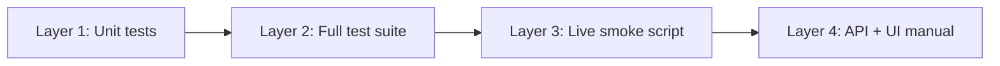

# Phase 6 testing plan — LLM agent, grounding & real chat stream

Validate that the grounded PydanticAI agent returns **streamed, cite-ready answers** (or honest refusals) before Phase 7 wires citation UI.

Related: [phase-six-implementation-plan.md](phase-six-implementation-plan.md) · [phase-six-implementation-issues.md](phase-six-implementation-issues.md) · [phase-five-testing-plan.md](phase-five-testing-plan.md) · [docs/todos.md](../docs/todos.md) · [docs/client-brief.md](../docs/client-brief.md) · [backend/scripts/smoke_agent.py](../backend/scripts/smoke_agent.py)

---

## Purpose

Phase 6 replaces the chat stub with a full turn pipeline: hybrid retrieval → PydanticAI agent → grounding validation → AI SDK SSE → persistence (`chat_messages` + `message_citations`). Testing must confirm:

1. Grounding rules enforce fail-closed citation contracts without calling OpenAI.
2. Orchestration wires retrieval, agent output, validation, and word deltas correctly (mocked).
3. `POST /chat/stream` preserves the AI SDK event shape and persists user + assistant messages.
4. Live smoke runs complete client-brief-style questions against Supabase + OpenAI.
5. Grounding failures produce a safe fallback message **without** citation rows (by design).

This document defines **what to test**, **when to run it**, and **pass/fail thresholds** — not implementation details.

---

## Definition of “correct” grounded chat

Success is measured by verifiable citations and honest refusals, not prose quality alone.

| Goal | Pass criteria |
|------|----------------|
| **Grounding contract** | Every persisted citation references a `chunk_id` retrieved in that turn; `excerpt` is a whitespace-normalized substring of `chunk_text` |
| **Fail-closed validation** | Invalid citations → `validation_failed=True`, fallback text streamed, **no** `message_citations` rows |
| **Insufficient evidence** | Model may return `insufficient_evidence=True` with empty `citations`; validator accepts; no citation rows |
| **SSE shape** | Event order unchanged: `start` → `text-start` → `text-delta*` → `text-end` → `finish` → `[DONE]`; header `x-vercel-ai-ui-message-stream: v1` |
| **Persistence** | User message inserted before stream; assistant message + `message_json.metadata.citations` (camelCase) on successful grounded turns |
| **Retrieval seed** | Orchestrator calls `DocumentRetriever.search()` before agent run; tool calls may add passages to turn registry |
| **Refusal case** | Weak-evidence questions (e.g. cross-company margin proof) return `insufficient_evidence` or grounding fallback — not fabricated citations |

**Not required for Phase 6 v1:**

- Live token-by-token model streaming (implementation uses `agent.run()` + post-hoc word deltas — see [phase-six-implementation-issues.md](phase-six-implementation-issues.md) §3)
- Citation chips / passage panel in the UI (Phase 7)
- Automated assertion of LLM answer quality or exact citation count
- Multi-turn conversation history in the agent prompt
- `openai_chat_timeout_seconds` / `agent_max_tool_calls` enforcement (config present; wiring deferred)

---

## Prerequisites

Before running integration or smoke tests:

| Requirement | Check |
|-------------|-------|
| Phase 5 retrieval green | `uv run pytest tests/retrieval/ -v` and `uv run python scripts/smoke_retrieval.py` exit 0 |
| Corpus ingested | 25 `source_documents`, ~7,470 `document_chunks`, embeddings populated |
| `backend/.env` populated | `DATABASE_URL` (direct `db.<ref>.supabase.co`), `OPENAI_API_KEY`, Supabase keys |
| Chat model setting | `OPENAI_CHAT_MODEL` optional; defaults to `gpt-4o-mini` |
| Auth user for UI tests | Signed-in user exists in `public.users` (RLS) |

Re-run Phase 5 smoke if corpus, embeddings, or retrieval settings change before agent work.

---

## Validation layers

Run checks from cheapest (no network) to most expensive (live DB + OpenAI).



### Layer 1 — Unit tests (no OpenAI)

**When:** Every code change to `app/assistant/`, `app/grounding/`, `app/chat/`, or `app/api/chat.py`.  
**Blocks merge:** Yes.  
**Runtime:** &lt; 10 seconds.

```powershell
cd backend
uv run pytest tests/grounding tests/assistant tests/chat -v
```

| File | What it proves |
|------|----------------|
| `tests/grounding/test_validator.py` | Valid citations pass; unknown `chunk_id` fails; ungrounded excerpt fails; `insufficient_evidence` rules |
| `tests/assistant/test_outputs.py` | `GroundedAnswer` / `Citation` Pydantic validation (non-empty answer, excerpt) |
| `tests/chat/test_messages_citations.py` | UI metadata camelCase (`stableChunkId`, `ticker`); DB metadata snake_case |
| `tests/chat/test_orchestrator.py` | Mocked `document_agent.run` + retriever; deltas reconstruct answer; `validation_failed=False` on valid output |
| `tests/chat/test_streaming.py` | SSE formatting; stub event order; `split_text_deltas` preserves spaces |
| `tests/chat/test_messages.py` | `extract_latest_user_text`, `build_assistant_ui_message` base shape |

**Pass:** All tests green, no skips.

**Build order rule (from implementation plan):** Run `tests/grounding/` before wiring live LLM — same discipline as Phase 5 fusion tests.

---

### Layer 2 — Full backend regression

**When:** Before committing Phase 6 changes or starting Phase 7.  
**Blocks merge:** Yes (ensures agent did not break retrieval, ingest, or chat API tests).

```powershell
cd backend
uv run pytest -v
```

**Pass:** Full suite green (currently **45** tests including retrieval, ingest, chat, API).

Key API regression:

| File | What it proves |
|------|----------------|
| `tests/api/test_chat_routes.py` | `POST /chat/stream` returns AI SDK SSE with mocked `stream_agent_turn`; user + assistant messages persisted; auth/404 paths |

The stream test **does not** call OpenAI — it monkeypatches `stream_agent_turn` and `insert_citations`.

---

### Layer 3 — Live smoke script

**When:** After Phase 6 implementation, after changing agent instructions, grounding rules, or chat model.  
**Blocks Phase 7:** Yes (for backend citation data).  
**Requires:** Live Supabase + OpenAI (retrieval embeddings + chat completion per query).

```powershell
cd backend
uv run python scripts/smoke_agent.py
```

**Pass:** Exit code `0`. Script runs three fixed queries via `stream_turn()` and prints validation outcome + citation count.

#### Smoke query matrix

| Query | Primary check | Expected outcome |
|-------|---------------|------------------|
| `For Amazon, what did the filing say about AWS operating margin?` | Retrieval + grounding | `validation_failed=False`; `citations >= 1`; answer mentions AWS/margin themes |
| `How did NVIDIA describe Data Center demand drivers?` | NVDA narrative | May pass or hit grounding fallback if excerpts don’t substring-match table-heavy chunks (see issues log) |
| `Do the filings prove that generative AI improved margins for any company?` | Refusal / honesty | `insufficient_evidence=True` or grounding-safe answer; **no** fabricated margin proof |

#### Smoke output checks (manual eyeball)

For each query, confirm printed fields:

- [ ] No uncaught exception (`ERROR:` line)
- [ ] `answer_preview` is coherent SEC-analyst prose or the known fallback message
- [ ] `validation_failed=True` only when grounding contract violated (acceptable for excerpt-mismatch cases)
- [ ] `citations` count matches `validation_failed` (0 citations when fallback after validation failure)
- [ ] Refusal query does not claim cross-company margin proof with citations

**Fail signals:**

| Symptom | Likely cause | See |
|---------|--------------|-----|
| `Missing credentials` | API key not passed to `OpenAIProvider` | [issues §1–2](phase-six-implementation-issues.md) |
| `stream_text() can only be used with text responses` | Structured output + `stream_text` | [issues §3](phase-six-implementation-issues.md) |
| All queries `validation_failed=True` | Strict excerpt matching vs Docling chunks | [issues §A](phase-six-implementation-issues.md) |
| `0` passages / retrieval errors | Phase 5 regression | [phase-five-testing-plan.md](phase-five-testing-plan.md) |

---

### Layer 4 — API + UI manual (optional but recommended)

**When:** Before Phase 7 citation UI; after smoke script passes.  
**Who:** Developer spot-check.  
**Duration:** ~15 minutes.

#### 4a — Authenticated stream via curl or frontend

1. Sign in via frontend (or obtain JWT).
2. Create or open a chat thread.
3. Ask: *"What did Amazon say about AWS operating margin?"*
4. Confirm streamed text appears in chat panel (text only — no citation chips yet).

#### 4b — Persistence check (Supabase or API)

```powershell
# After a successful grounded turn, fetch thread messages
# GET /chat/threads/{thread_id}/messages
```

| Check | Pass |
|-------|------|
| Assistant `message_json.parts[0].text` matches streamed answer | Yes |
| `message_json.metadata.citations` present on grounded success | Array with `chunkId`, `stableChunkId`, `excerpt`, `ticker` |
| `message_citations` rows | One row per citation on successful validation |
| Grounding fallback turn | Assistant message persisted; `metadata.citations` absent or empty; no `message_citations` |

#### 4c — Client-brief spot-check (manual)

From [client-brief.md](../docs/client-brief.md), prioritize:

1. **#2** — AMZN / AWS operating margin (expect citations)
2. **#3** — NVDA Data Center demand (expect citations or honest limitation)
3. **#10** — “Prove generative AI improved margins” (expect refusal / insufficient evidence)

---

## Per-module test coverage map

| Module | Unit tested? | Integration tested? | How |
|--------|-------------|----------------------|-----|
| `grounding/validator.py` | Yes | Smoke (indirect) | `test_validator.py` |
| `assistant/outputs.py` | Yes | — | `test_outputs.py` |
| `assistant/agent.py` | No | Smoke | Tools exercised only in live runs |
| `assistant/deps.py` | No | Smoke | Passed through `stream_turn` |
| `chat/orchestrator.py` | Yes (mocked agent) | Smoke | `test_orchestrator.py` + `smoke_agent.py` |
| `chat/streaming.py` | Yes (SSE helpers) | API test (mocked) | `test_streaming.py` + `test_chat_routes.py` |
| `chat/messages.py` | Yes | API test | `test_messages.py`, `test_messages_citations.py` |
| `api/chat.py` | Partial | Manual UI | `test_chat_routes.py` mocks agent |
| `database/chats.py` | No (direct) | Manual / UI | `insert_citations` via live stream |
| `database/documents.py` | No (Phase 6) | Smoke (tools) | `read_chunk` / neighbors in agent tools |
| `retrieval/retriever.py` | Yes (Phase 5) | Smoke | Unchanged; regression via full pytest |

### Recommended future automated tests (optional)

Add when agent tuning becomes frequent:

| Test | Type | Approach |
|------|------|----------|
| `test_search_filings_registers_passages` | Unit | Mock retriever + session; assert `deps.retrieved_passages` updated |
| `test_read_surrounding_chunks_stays_in_session` | Unit | Mock DB rows; assert no session-after-close |
| `test_stream_agent_turn_event_order` | Unit | Mock `stream_turn`; assert SSE sequence matches stub contract |
| `test_insert_citations_called_on_success` | API | Extend `test_post_stream` with citation payload assertion |
| `test_agent_smoke_amzn_has_citations` | Integration (`pytest.mark.integration`) | Skip without `.env`; run one query; assert `citations >= 1` |

Mark integration tests with `@pytest.mark.integration` and skip by default in CI until a test DB + API key are available.

---

## Configuration under test

Defaults in `app/config.py` (override via env):

| Setting | Default | Test impact |
|---------|---------|-------------|
| `openai_chat_model` | `gpt-4o-mini` | Smoke + live stream model |
| `openai_chat_timeout_seconds` | 120 | Not yet wired to Agent — no test |
| `agent_max_tool_calls` | 5 | Not yet enforced — no test |
| `retrieval_*` | Phase 5 defaults | Seed passages per turn; unchanged tests |

Re-run Layer 3 smoke after changing `openai_chat_model`, agent instructions, or grounding validator logic.

---

## When to re-run tests

| Event | Layers to run |
|-------|---------------|
| Edit `grounding/validator.py` | 1, 2 |
| Edit `assistant/outputs.py`, `chat/messages.py` | 1, 2 |
| Edit `orchestrator.py`, `streaming.py`, `api/chat.py` | 1, 2, 3 |
| Edit `assistant/agent.py` or `instructions.md` | 2, 3, 4 |
| Change `openai_chat_model` or OpenAI key | 3, 4 |
| Phase 5 retrieval/corpus change | 2, 3 (+ Phase 5 Layer 3) |
| Before starting Phase 7 | 2, 3, 4 |

---

## Phase 7 handoff criteria

Phase 6 agent + chat stream is ready for citation UI when:

- [ ] `uv run pytest tests/grounding tests/assistant tests/chat -v` — all green
- [ ] `uv run pytest -v` — full suite green (45 tests)
- [ ] `uv run python scripts/smoke_retrieval.py` — exit code 0 (retrieval regression)
- [ ] `uv run python scripts/smoke_agent.py` — exit code 0
- [ ] Manual check: at least one smoke query returns `validation_failed=False` with `citations >= 1`
- [ ] Manual check: refusal query does not persist unsupported citations
- [ ] `GET /chat/threads/{id}/messages` returns `metadata.citations` on successful grounded turns
- [ ] Frontend streams real answers (not stub text) with no SSE breakage

Phase 7 will add:

- Citation chips and passage panel reading `message_json.metadata.citations`
- Click-to-verify against `stableChunkId` / chunk text
- Optional E2E tests in the frontend test runner

---

## Quick reference commands

```powershell
# Grounding + chat unit tests (fast, no network)
cd backend
uv run pytest tests/grounding tests/assistant tests/chat -v

# Full backend regression
uv run pytest -v

# Retrieval regression (prerequisite)
uv run python scripts/smoke_retrieval.py

# Live agent smoke (Supabase + OpenAI)
uv run python scripts/smoke_agent.py

# Lint Phase 6 modules
uv run ruff check app/assistant app/grounding app/chat/orchestrator.py app/chat/streaming.py app/chat/messages.py app/api/chat.py tests/grounding tests/assistant tests/chat
```

---

## Definition of done (testing)

- [x] Unit tests for grounding validator committed under `tests/grounding/`
- [x] Unit tests for `GroundedAnswer` / `Citation` under `tests/assistant/`
- [x] Orchestrator mock test under `tests/chat/test_orchestrator.py`
- [x] Citation metadata tests under `tests/chat/test_messages_citations.py`
- [x] Chat API stream test updated to mock `stream_agent_turn` (no live OpenAI in CI)
- [x] Smoke script committed at `backend/scripts/smoke_agent.py`
- [x] Full suite pass recorded (45 tests, 2026-06-08)
- [ ] Optional: dedicated agent tool unit tests
- [ ] Optional: pytest integration marker for single-query live agent assertion
- [ ] Optional: automated `message_citations` row count check in API test
