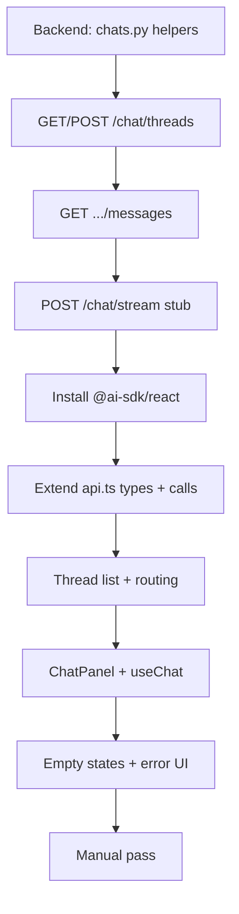

# Phase 3 implementation plan — stubbed chat vertical slice

End-to-end chat UX with **no retrieval or LLM**. Proves threads, persistence, streaming transport, and UI before corpus work (Phases 4–6).

Reference: [docs/todos.md](../docs/todos.md) · [docs/architecture.md](../docs/architecture.md)

---

## Goal

Deliver a working chat loop:

**Sign in → create thread → send question → see stubbed streamed reply → refresh → history persists → sign out**

---

## Current state (as of Phase 2 complete)

| Area | Status |
|------|--------|
| Auth shell | Done — `ProtectedRoute`, `useSession`, bearer token via `apiFetch` |
| App shell | Placeholder sidebar (“No conversations yet”), disabled “New chat” button |
| Home page | Phase 2 diagnostics (`GET /health`, `GET /me`) |
| `api.ts` | Only `getHealth` / `getCurrentUser` |
| AI SDK | Not installed |
| Backend chat routes | Not implemented — only `/health` and `/me` |
| DB schema | `chat_threads`, `chat_messages` exist with RLS |

---

## Build order (dependency graph)



**Rule:** Do not wire `useChat` until `POST /chat/stream` returns AI SDK–compatible events and persists messages. Frontend can scaffold components in parallel, but integration testing requires the backend stub.

---

## Backend (stubbed chat API)

See [Backend implementation detail](#backend-implementation-detail) for file-by-file steps, SSE protocol, tests, and curl verification.

### Checklist

- [ ] `app/database/chats.py` — typed read/write helpers for threads and messages (user-scoped via Supabase client)
- [ ] `GET/POST /chat/threads` — list and create threads
- [ ] `GET /chat/threads/{id}/messages` — message history for a thread
- [ ] `POST /chat/stream` — AI SDK-compatible streaming events with a **fixed stub reply** (no OpenAI, no retrieval); persist user message + stub assistant message after stream completes
- [ ] Unit tests: thread ownership, message ordering, stub stream event shape

### API contract (frontend-facing)

| Endpoint | Purpose | Expected shape |
|----------|---------|----------------|
| `GET /chat/threads` | Sidebar list | `[{ id, title, createdAt, updatedAt }]` |
| `POST /chat/threads` | New chat | `{ id, title }` — body optional `{ title?: string }` |
| `GET /chat/threads/{id}/messages` | Hydrate history | AI SDK `UIMessage[]` or `{ messages: UIMessage[] }` |
| `POST /chat/stream` | Send + stream | Body: `{ threadId, messages }` |

**Stream endpoint:**

```text
POST /chat/stream
Authorization: Bearer <supabase_access_token>
Content-Type: application/json
```

Request body:

```json
{
  "threadId": "uuid",
  "messages": []
}
```

The `messages` payload uses the AI SDK UI message format at the frontend boundary. FastAPI translates that wire format into internal models before invoking the agent (Phase 6).

**Streaming responsibilities:**

- Send text deltas as the answer is generated
- Send clear error events for auth failures, missing threads, etc.
- Persist user message + stub assistant message **after** stream completes

Stub can emit a fixed string like *“This is a stubbed reply. Retrieval and the real agent come in Phase 6.”* chunked over ~500ms.

**Error codes** (from architecture):

- `401` — missing, expired, or invalid token
- `403` — authenticated user tries to access another user's thread
- `404` — thread does not exist
- `502` — Supabase / PostgREST failure
- `422` — invalid request payload

---

## Frontend (wired chat UI)

### Checklist

- [ ] Replace Phase 2 home diagnostic with chat-first layout (or demote diagnostics to dev-only)
- [ ] Thread list: load from backend, create new thread, switch threads
- [ ] Chat composer + message list (user vs assistant styling, streaming indicator, error states)
- [ ] Vercel AI SDK `useChat` → `POST /chat/stream` with Supabase bearer token
- [ ] Empty states: no threads yet, no messages in thread

### Step 0 — Dependencies

```bash
cd frontend
pnpm add @ai-sdk/react ai
```

Verify `useChat` + `DefaultChatTransport` against the installed version (architecture cites AI SDK v5-style transport).

### Step 1 — Types and API layer

Extend `src/lib/api.ts`:

```ts
export type ChatThread = {
  id: string
  title: string
  createdAt: string
  updatedAt: string
}

export type ChatMessage = {
  id: string
  role: "user" | "assistant"
  parts: ... // match backend wire format
}

listThreads(): Promise<ChatThread[]>
createThread(title?: string): Promise<ChatThread>
getThreadMessages(threadId: string): Promise<ChatMessage[]>
```

Keep streaming **out of** `api.ts` — `useChat` owns the stream via `DefaultChatTransport`.

### Step 2 — Routing and thread selection

| Route | Behavior |
|-------|----------|
| `/` | Redirect to `/chat` or auto-select most recent thread |
| `/chat` | Empty state when no thread selected |
| `/chat/:threadId` | Load messages, render chat panel |

Update `App.tsx` nested routes under `AppShell`.

**Thread switching:** URL is source of truth (`useParams().threadId`). Sidebar `Link` or `navigate()` on click.

### Step 3 — Refactor `AppShell.tsx`

| Concern | Where |
|---------|-------|
| Thread list data | `useThreads()` hook or lift state in `AppShell` |
| Create thread | Enable `MessageSquarePlus` → `POST /chat/threads` → navigate to new id |
| Active thread highlight | Compare `threadId` param to list items |
| Sign out | Keep as-is |

Load threads on mount; refetch after create or after stream completes (optional optimistic update).

### Step 4 — Chat components (`src/components/chat/`)

| Component | Responsibility |
|-----------|----------------|
| `ThreadList.tsx` | Renders list, loading skeleton, “no threads” empty state |
| `ThreadListItem.tsx` | Title + relative time; active styling |
| `ChatPanel.tsx` | Owns `useChat` for current `threadId` |
| `MessageList.tsx` | Scrollable list; auto-scroll on new content |
| `MessageBubble.tsx` | User right/primary vs assistant left/muted |
| `ChatComposer.tsx` | Textarea + send; disabled while `status === "streaming"` |
| `StreamingIndicator.tsx` | Typing dots or pulsing cursor on last assistant message |
| `ChatErrorBanner.tsx` | Surfaces `error` from `useChat` + retry |

### Step 5 — `useChat` integration (`ChatPanel.tsx`)

Per [architecture.md](../docs/architecture.md):

```ts
const { messages, sendMessage, status, error, setMessages } = useChat({
  id: threadId,
  messages: initialMessages,
  transport: new DefaultChatTransport({
    api: `${getEnv().apiBaseUrl}/chat/stream`,
    headers: async () => ({
      Authorization: `Bearer ${await getAccessToken()}`,
    }),
  }),
})
```

**Lifecycle:**

1. On `threadId` change → fetch history → `setMessages(converted)`.
2. On submit → `sendMessage({ text: input })` (exact API per installed SDK version).
3. On stream complete → optional thread list refetch (title may update later in Phase 6).

### Step 6 — Replace / demote Phase 2 diagnostics

- **Preferred:** Remove `HomePage` diagnostic card from main flow; chat is the home experience.
- **Optional dev-only:** Keep checks at `/dev/health` or behind `import.meta.env.DEV`.

### Step 7 — Empty states

| Condition | UI |
|-----------|-----|
| No threads (`GET /chat/threads` → `[]`) | Sidebar dashed box: “Start your first conversation” + prominent New chat CTA |
| Thread selected, no messages | Main area: “Ask a question about SEC filings” + composer focused |
| Loading threads/messages | Skeleton rows in sidebar; spinner in message area |

### Step 8 — Error states

| Source | UX |
|--------|-----|
| `401` on API call | `ProtectedRoute` already handles; ensure token refresh isn’t stale |
| `403` / `404` on thread | Banner: “Conversation not found” + link back to `/chat` |
| Stream / network failure | `ChatErrorBanner` with message + “Try again” |
| Empty token | Disable composer; prompt re-login |

Use existing `ApiError` from `http.ts` for REST; map `useChat` `error` separately.

---

## File checklist (frontend)

### New files

- [ ] `src/hooks/useThreads.ts` — list, create, loading/error state
- [ ] `src/pages/ChatPage.tsx` — orchestrates thread param + `ChatPanel`
- [ ] `src/components/chat/ThreadList.tsx`
- [ ] `src/components/chat/ThreadListItem.tsx`
- [ ] `src/components/chat/ChatPanel.tsx`
- [ ] `src/components/chat/MessageList.tsx`
- [ ] `src/components/chat/MessageBubble.tsx`
- [ ] `src/components/chat/ChatComposer.tsx`
- [ ] `src/components/chat/StreamingIndicator.tsx`
- [ ] `src/components/chat/ChatErrorBanner.tsx`
- [ ] `src/lib/chat-types.ts` (optional) — shared thread/message types

### Modify

- [ ] `package.json` — add `@ai-sdk/react`, `ai`
- [ ] `src/lib/api.ts` — thread + message REST helpers
- [ ] `src/App.tsx` — `/chat`, `/chat/:threadId` routes
- [ ] `src/components/AppShell.tsx` — wire real thread list, enable New chat
- [ ] Remove or relocate `src/pages/HomePage.tsx`

### Verify

- [ ] `pnpm tsc --noEmit`
- [ ] `pnpm lint`
- [ ] No secrets in client bundle (only anon key + API base URL)

---

## Manual pass

Run with both servers up:

```powershell
# Terminal 1
cd backend && uv run uvicorn app.main:app --reload

# Terminal 2
cd frontend && pnpm dev
```

| Step | Action | Expected |
|------|--------|----------|
| 1 | Open `http://localhost:5173/login`, sign in | Lands on chat shell |
| 2 | Sidebar shows “no conversations” (first visit) | Empty state visible |
| 3 | Click **New chat** | New thread in sidebar; URL `/chat/{uuid}`; empty message area |
| 4 | Type “What is AWS margin?” and send | User bubble appears immediately |
| 5 | Wait for stream | Assistant bubble streams stub text incrementally; streaming indicator visible |
| 6 | Stream completes | Indicator disappears; both messages stable |
| 7 | Hard refresh (F5) | Same thread selected (or re-navigate); **both messages still visible** |
| 8 | Create second thread, send another message | Thread list shows 2 items; switching threads loads correct history |
| 9 | Sign out | Redirect to login; back button doesn’t leak chat without auth |

**Failure signals to watch:**

- CORS errors → check `ALLOWED_ORIGINS`
- 401 on stream but REST works → bearer header not passed in `DefaultChatTransport`
- Messages vanish on refresh → backend not persisting or frontend not hydrating from `GET .../messages`
- Garbled stream → backend event format doesn’t match AI SDK version

---

## Definition of done (Phase 3)

### Backend

- [ ] Thread CRUD helpers and REST routes working with RLS
- [ ] Stub stream endpoint emits AI SDK–compatible events
- [ ] User + assistant messages persisted after each turn
- [ ] Unit tests pass

### Frontend

- [ ] Thread list loads from backend; create and switch work
- [ ] Composer sends via `useChat` → `POST /chat/stream` with Supabase bearer token
- [ ] User vs assistant styling, streaming indicator, error banner
- [ ] Empty states for no threads and no messages
- [ ] Manual pass complete
- [ ] Phase 2 diagnostics removed or dev-only

---

## Explicitly out of scope (Phase 3)

- Citations UI, source passage panel (Phase 7)
- Real retrieval / OpenAI / PydanticAI (Phases 4–6)
- Thread rename, delete, search
- Auto thread title from first message (optional in backend via `maybe_set_thread_title`; not required for Phase 3 done)

---

## Suggested work split (solo, ~2–3 days)

| Day | Focus |
|-----|-------|
| 1 | Backend stub API + unit tests; frontend deps + `api.ts` + routing |
| 2 | `AppShell` thread list, `ChatPanel` + `useChat`, message bubbles |
| 3 | Empty/error states, polish, manual pass, fix stream format mismatches |

---

## Architecture references

Frontend module layout (from [architecture.md](../docs/architecture.md)):

- `src/lib/env.ts` — validates env vars
- `src/lib/supabase.ts` — browser Supabase client + `getAccessToken()`
- `src/lib/http.ts` — authenticated `fetch` wrapper
- `src/lib/api.ts` — product-level REST calls (threads, messages)
- `src/pages/chat/*` — chat routes
- `src/components/chat/*` — messages, empty states, streaming status

Backend module layout (Phase 3 subset):

```text
backend/app/
├── api/
│   └── chat.py                 # FastAPI routes (thin handlers)
├── chat/
│   ├── schemas.py              # Request/response Pydantic models
│   ├── messages.py             # AI SDK ↔ internal message helpers
│   └── streaming.py            # Stub SSE event generator (swap in Phase 6)
└── database/
    └── chats.py                # Supabase read/write helpers (RLS-scoped)
```

Register routes in `main.py`:

```python
from app.api.chat import router as chat_router

app.include_router(chat_router, prefix="/chat", tags=["chat"])
```

Paths become `/chat/threads`, `/chat/threads/{id}/messages`, `/chat/stream` — not double-prefixed.

---

## Backend implementation detail

The checklist above is the **what**. This section is the **how** — file-by-file, in build order.

### Schema and access model (already migrated)

Runtime chat I/O uses the **user-scoped Supabase client** (`get_user_scoped_supabase`), not SQLAlchemy sessions. SQLAlchemy models exist for Alembic only; RLS enforces ownership via `auth.uid()`.

| Table | Columns that matter for Phase 3 |
|-------|-----------------------------------|
| `chat_threads` | `id`, `user_id`, `title` (default `"New chat"`), `created_at`, `updated_at` |
| `chat_messages` | `id`, `thread_id`, `role` (`user` \| `assistant`), `content_text`, `message_json` (JSONB), `sequence_number` (unique per thread), `created_at` |

RLS policies (already in migration):

- `chat_threads`: `auth.uid() = user_id` for all ops
- `chat_messages`: allowed only when parent thread belongs to `auth.uid()`

**Prerequisite:** User must exist in `public.users` (created by `handle_new_user` trigger when added in Supabase dashboard). Thread insert will fail FK otherwise.

**Ordering:** Always list messages by `sequence_number` ascending, not `created_at` alone.

### Step 1 — `app/chat/schemas.py`

- [ ] `ThreadResponse` — `id`, `title`, `created_at`, `updated_at` (serialize as camelCase for frontend if using a shared alias config, or match frontend types explicitly)
- [ ] `CreateThreadRequest` — optional `title`, default `"New chat"`
- [ ] `MessageResponse` — `id`, `role`, `content_text`, `sequence_number`, `created_at`, optional `message_json`
- [ ] `ChatStreamRequest` — `threadId: UUID`, `messages: list[dict]` (AI SDK `UIMessage[]` at the wire boundary)
- [ ] `MessagesListResponse` — `{ messages: list[...] }` if returning wrapped history for `GET .../messages`

Use Pydantic v2 `model_config` or field aliases if the frontend expects `createdAt` / `threadId` camelCase on JSON responses.

### Step 2 — `app/chat/messages.py`

Pure helpers (easy to unit test without Supabase):

- [ ] `extract_latest_user_text(messages: list[dict]) -> str` — walk the last message with `role == "user"`; concatenate `parts` where `type == "text"` (AI SDK v5 shape)
- [ ] `to_ui_message(row: MessageResponse) -> dict` — map DB row → AI SDK `UIMessage` for history hydration
- [ ] `build_assistant_ui_message(message_id: str, text: str) -> dict` — minimal assistant `message_json` blob for persistence
- [ ] Raise `ValueError` when no user text found → route maps to **422**

Also support legacy `content` string field on messages if the SDK sends it — check installed `@ai-sdk/react` version during frontend Step 0.

### Step 3 — `app/database/chats.py`

All functions take `client: Client` from `get_user_scoped_supabase`.

| Function | Behavior |
|----------|----------|
| `list_threads(client)` | `.table("chat_threads").select("*").order("updated_at", desc=True)` |
| `create_thread(client, user_id, title?)` | Insert `{ user_id, title }`; return inserted row |
| `get_thread(client, thread_id)` | Select by id; return `None` if RLS hides row |
| `list_messages(client, thread_id)` | Filter by `thread_id`, order `sequence_number` asc |
| `next_sequence_number(client, thread_id)` | Max `sequence_number` + 1, or `0` if empty |
| `insert_message(client, thread_id, role, content_text, message_json, seq)` | Insert one row; return row |
| `touch_thread(client, thread_id)` | Update `updated_at` after new messages |
| `maybe_set_thread_title(client, thread_id, first_user_text)` | **Optional** — if title is still `"New chat"`, set truncated first line (~60 chars) |

**Persistence rules for stub phase:**

- Store plain text in `content_text` and full AI SDK shape in `message_json`.
- On each stream turn: insert **user** message first, stream stub, then insert **assistant** message only after the full stub text is emitted.
- If the client disconnects mid-stream, skip assistant insert (simplest; avoids partial rows).

**Supabase errors:** Wrap PostgREST failures; route layer returns **502** with generic detail; log the underlying error.

### Step 4 — `app/api/chat.py` (REST routes)

All routes: `Depends(get_current_user)` + `Depends(get_user_scoped_supabase)`.

| Method | Path | Handler logic |
|--------|------|---------------|
| `GET` | `/threads` | `list_threads` → JSON array |
| `POST` | `/threads` | `create_thread(current_user.id, body.title)` |
| `GET` | `/threads/{thread_id}/messages` | `get_thread` → **404** if missing; else `list_messages` mapped to UI messages |

**404 vs 403:** When RLS hides another user's thread, PostgREST returns empty — treat as **404** (do not leak thread existence). Reserve **403** for explicit ownership checks if added later.

Wire router in `main.py` as shown above.

### Step 5 — `app/chat/streaming.py` (stub SSE)

AI SDK **UI message stream v1** requires:

- Response `media_type="text/event-stream"`
- Header: `x-vercel-ai-ui-message-stream: v1` (required — stream will not parse without it)
- Each event: `data: {json}\n\n`

**Event sequence** (in order):

```text
data: {"type":"start","messageId":"<uuid>"}

data: {"type":"text-start","id":"<text_id>"}

data: {"type":"text-delta","id":"<text_id>","delta":"chunk"}

data: {"type":"text-end","id":"<text_id>"}

data: {"type":"finish"}

data: [DONE]
```

Implementation notes:

- [ ] `format_sse_event(payload: dict) -> str` — pure helper for tests
- [ ] `async def stub_stream_events(full_text: str) -> AsyncIterator[str]` — split text into word chunks; optional `asyncio.sleep(0.05)` between deltas so UI shows streaming
- [ ] Stub template: *"Document Copilot stub: ingestion and retrieval are not connected yet. Your question was: \"{user_text}\""*

Reference: [AI SDK stream protocol](https://ai-sdk.dev/docs/ai-sdk-ui/stream-protocol)

### Step 6 — `POST /chat/stream` handler flow

In `app/api/chat.py` (or delegate to `run_stub_turn(...)` in `streaming.py`):

1. Parse `ChatStreamRequest`; validate `threadId` and extract user text via `messages.py`.
2. `get_thread` → **404** if not found.
3. `next_sequence_number` → insert **user** message (`role=user`, `message_json` from last client message).
4. Optional: `maybe_set_thread_title`.
5. Build stub full text; return `StreamingResponse(stub_stream_events(...), headers=...)`.
6. **After** stream completes (inside the async generator's finally block or after last yield): insert **assistant** message with accumulated text + `build_assistant_ui_message`.
7. `touch_thread`.

The generator must accumulate delta text in a local variable so the final assistant row has the complete string.

### Step 7 — Unit tests (`backend/tests/`)

No test folder exists yet. Add:

```toml
# pyproject.toml
[tool.pytest.ini_options]
testpaths = ["tests"]
pythonpath = ["."]
```

Suggested files:

| File | Covers |
|------|--------|
| `tests/chat/test_messages.py` | `extract_latest_user_text`, UI message mapping |
| `tests/chat/test_streaming.py` | SSE line format, event order, `x-vercel-ai-ui-message-stream` header on route |
| `tests/api/test_chat_routes.py` | 401 without token; 404 unknown thread; mocked `chats.py` inserts |

**Test priorities (from todos):**

- [ ] Thread ownership — cannot read another user's thread (mock empty Supabase response → 404)
- [ ] Message ordering — `list_messages` returns ascending `sequence_number`
- [ ] Stub stream shape — events include `start`, `text-start`, `text-delta`, `text-end`, `finish`, `[DONE]`

Use `httpx.AsyncClient` + FastAPI `ASGITransport` with dependency overrides to mock `get_user_scoped_supabase` / `get_current_user` for route tests. Pure streaming tests need no Supabase.

Run: `cd backend && uv run pytest`

### Backend-only build order (1–2 sessions)

1. `schemas.py` + `messages.py` + tests for message helpers  
2. `chats.py` — threads + messages CRUD; verify manually in Supabase dashboard  
3. `GET/POST /threads` + `GET .../messages` — curl with bearer token  
4. `streaming.py` — SSE formatter + generator; isolated tests  
5. `POST /stream` — full turn with persistence  
6. Route tests + fix stream format against frontend once `@ai-sdk/react` is installed  

### Backend manual verification (curl)

```powershell
# Replace TOKEN and THREAD_ID after creating a thread

curl -H "Authorization: Bearer TOKEN" http://localhost:8000/chat/threads

curl -X POST -H "Authorization: Bearer TOKEN" -H "Content-Type: application/json" `
  -d "{}" http://localhost:8000/chat/threads

curl -H "Authorization: Bearer TOKEN" `
  http://localhost:8000/chat/threads/THREAD_ID/messages

curl -N -X POST -H "Authorization: Bearer TOKEN" -H "Content-Type: application/json" `
  -d '{"threadId":"THREAD_ID","messages":[{"id":"u1","role":"user","parts":[{"type":"text","text":"What was AWS margin?"}]}]}' `
  http://localhost:8000/chat/stream
```

**Verify in Supabase Table Editor:**

- Two rows in `chat_messages` for the thread (`sequence_number` 0 and 1)
- User row matches sent text; assistant row matches full stub reply
- `chat_threads.updated_at` bumped

### Error handling (backend)

| Case | Status |
|------|--------|
| Missing / invalid JWT | 401 (auth deps) |
| Thread not found / RLS empty | 404 |
| Missing `threadId` or user message | 422 |
| Supabase insert/select failure | 502 |

### What Phase 6 reuses unchanged

Keep these stable so Phase 6 only swaps the generator behind `POST /chat/stream`:

- Route paths and auth dependencies  
- `chats.py` persistence helpers  
- SSE envelope (`start` → `text-*` → `finish` → `[DONE]`) and response headers  
- `messages.py` wire-format conversion  

Replace `streaming.py` stub with real `orchestrator.py` + agent stream adapter; do not rename endpoints.

### Backend ↔ frontend contract notes

- Align camelCase: frontend `ChatThread.createdAt` ↔ backend JSON field names (use Pydantic aliases or snake_case consistently in both layers).
- `GET .../messages` should return shapes `useChat` accepts as `initialMessages` — prefer AI SDK `UIMessage[]` or `{ messages: UIMessage[] }` documented in Step 1.
- Pin `@ai-sdk/react` + `ai` versions together; run one end-to-end stream test before marking Phase 3 done — protocol mismatches are the most common failure (see Manual pass failure signals).
