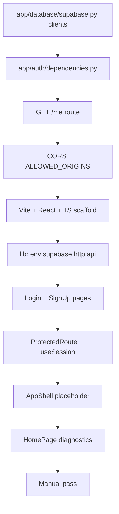

# Phase 2 implementation plan — auth shell & frontend scaffold

Wire Supabase email auth end-to-end: browser sign-in, bearer token on API calls, protected app shell, and a diagnostic page proving `GET /health` and `GET /me` work.

Reference: [docs/todos.md](../docs/todos.md) · [docs/architecture.md](../docs/architecture.md) · [docs/guides/frontend-setup.md](../docs/guides/frontend-setup.md) · [docs/guides/backend-setup.md](../docs/guides/backend-setup.md)

**Status:** Complete (retrospective — reflects what is configured in the repo today). Phase 3 replaced the home diagnostic with chat UI; diagnostics live at `/dev/health` in dev builds.

---

## Goal

Deliver the authenticated thin shell:

**Create user in Supabase → sign in → land in app shell → health + `/me` OK with bearer token → sign out**

No chat API, no ingestion, no LLM calls. The frontend only talks to `/health` (public) and `/me` (protected).

---

## Current state (at Phase 2 start)

| Area | Status |
|------|--------|
| Phase 1 schema | Done — tables + RLS migrated |
| Backend routes | Only `GET /health` |
| Auth | Not wired — no JWT verification |
| Frontend | Not scaffolded |
| CORS | Default stub in main |

---

## Build order (dependency graph)



**Rule:** Backend auth deps must work (`GET /me` with bearer token) before wiring the frontend `apiFetch` wrapper. CORS must allow `http://localhost:5173` before browser testing.

---

## Backend — auth & Supabase clients

### Step 1 — `app/database/supabase.py`

| Function | Behavior |
|----------|----------|
| `create_user_scoped_client(access_token)` | Anon key + user JWT in headers → PostgREST runs as `authenticated`, RLS applies |
| `get_service_role_client()` | Cached service-role client; bypasses RLS (Phase 4 ingest) |

Client options: `auto_refresh_token=False`, `persist_session=False` (stateless API).

### Step 2 — `app/auth/dependencies.py`

| Dependency | Behavior |
|------------|----------|
| `get_bearer_token` | `HTTPBearer`; 401 if missing/invalid scheme |
| `get_current_user` | Validates JWT via `client.auth.get_user(jwt=...)` → `CurrentUser(id, email, access_token)` |
| `get_user_scoped_supabase` | Returns user-scoped client for Data API calls (Phase 3 chats) |

`CurrentUser` is a frozen dataclass — routes never trust client-supplied user IDs.

### Step 3 — Protected route smoke test

Add to `app/main.py`:

```python
@app.get("/me")
def me(current_user: Annotated[CurrentUser, Depends(get_current_user)]) -> dict[str, str]:
    return {"id": current_user.id, "email": current_user.email}
```

### Step 4 — CORS

In `app/config.py`:

- `allowed_origins` parsed from comma-separated `ALLOWED_ORIGINS`
- Default includes `http://localhost:5173`

In `app/main.py`:

```python
app.add_middleware(
    CORSMiddleware,
    allow_origins=settings.allowed_origins,
    allow_credentials=True,
    allow_methods=["*"],
    allow_headers=["*"],
)
```

### Backend checklist

- [x] `app/database/supabase.py`
- [x] `app/auth/dependencies.py`
- [x] `GET /me` with 401 without token
- [x] CORS for local Vite dev server

### Backend manual verification (curl)

```powershell
# Public
curl http://localhost:8000/health

# Protected — replace TOKEN from Supabase session
curl -H "Authorization: Bearer TOKEN" http://localhost:8000/me
```

---

## Frontend — Vite SPA scaffold

Plain **Vite + React SPA** — not Next.js. See [frontend/AGENTS.md](../frontend/AGENTS.md).

### Step 0 — Dependencies

Per [frontend-setup.md](../docs/guides/frontend-setup.md):

```powershell
cd frontend
pnpm install
pnpm add react-router-dom @supabase/supabase-js
pnpm add -D tailwindcss @tailwindcss/vite
pnpm dlx shadcn@latest init
```

Package manager: **pnpm only** (`.npmrc` minimum-release-age policy).

### Step 1 — Env module (`src/lib/env.ts`)

Validates at boot:

| Variable | Purpose |
|----------|---------|
| `VITE_API_BASE_URL` | FastAPI base (no trailing slash) |
| `VITE_SUPABASE_URL` | Browser Supabase client |
| `VITE_SUPABASE_ANON_KEY` | Public anon key only |

Never read `import.meta.env` outside this module.

Copy from `frontend/.env.example` → `frontend/.env`.

### Step 2 — Supabase browser client (`src/lib/supabase.ts`)

- `createClient(supabaseUrl, supabaseAnonKey)`
- `getAccessToken()` — reads session access token for API calls

### Step 3 — HTTP layer (`src/lib/http.ts`)

- `apiFetch(path, options)` — prepends `VITE_API_BASE_URL`, injects `Authorization: Bearer …` by default
- `ApiError` — typed error with `status` and response body
- 401 when no session token

### Step 4 — Product API (`src/lib/api.ts`)

Phase 2 surface:

```ts
getHealth(): Promise<{ status: string }>   // no auth
getCurrentUser(): Promise<{ id, email }>  // via apiFetch("/me")
```

### Step 5 — Auth pages

| Route | Component | Behavior |
|-------|-----------|----------|
| `/login` | `LoginPage` | Email + password via `supabase.auth.signInWithPassword` |
| `/signup` | `SignUpPage` | Email sign-up (disabled in prod — users created in Supabase dashboard) |

Wrapped in `AuthLayout` with tab navigation between login/signup.

`PublicRoute` redirects authenticated users away from auth pages.

### Step 6 — Session hook (`src/hooks/useSession.ts`)

- Initial `getSession()` + `onAuthStateChange` subscription
- Exposes `{ session, user, loading, signOut }`

### Step 7 — Route guards

| Component | Behavior |
|-----------|----------|
| `ProtectedRoute` | Loading spinner → redirect to `/login` if no session |
| `PublicRoute` | Redirect to `/` if already signed in |

### Step 8 — App shell (`src/components/AppShell.tsx`)

Phase 2 placeholder layout:

- Sidebar: “Document Copilot” header, **Conversations** section with dashed empty state, disabled **New chat** button
- Main: header + `<Outlet />` for child routes
- Footer: user email + **Sign out**

Real thread list arrives in Phase 3.

### Step 9 — Phase 2 diagnostic home (`src/pages/HomePage.tsx`)

Card UI calling:

1. `GET /health` (unauthenticated `fetch`)
2. `GET /me` (authenticated `apiFetch`)

Shows OK/Failed per check with re-run button.

> **Phase 3 note:** Chat replaced this as the home experience. The same diagnostic UI now lives in `DevHealthPage.tsx` at `/dev/health` (dev-only route).

### Step 10 — Router (`src/App.tsx`)

Phase 2 routes:

```text
/login, /signup          → public auth pages
/                        → ProtectedRoute → AppShell
  index                  → HomePage (diagnostics)
*                        → redirect /
```

Phase 3 adds `/chat` routes and removes home diagnostic from main flow.

### Frontend checklist

- [x] Vite + React + TypeScript strict
- [x] Tailwind v4 + `@tailwindcss/vite` + shadcn/ui (`components/ui/`)
- [x] `src/lib/env.ts`, `supabase.ts`, `http.ts`, `api.ts`
- [x] `LoginPage`, `SignUpPage`, `AuthLayout`
- [x] `ProtectedRoute`, `PublicRoute`, `useSession`
- [x] `AppShell` placeholder sidebar
- [x] `HomePage` Phase 2 manual pass card

### Verify

```powershell
cd frontend
pnpm exec tsc --noEmit
pnpm lint
pnpm dev
```

---

## File checklist (Phase 2)

### Backend — new/modified

- [x] `app/database/supabase.py`
- [x] `app/auth/dependencies.py`
- [x] `app/main.py` — `GET /me`, CORS
- [x] `app/config.py` — `allowed_origins` validator

### Frontend — new

- [x] `frontend/` Vite project (`package.json`, `vite.config.ts`, `tsconfig*.json`)
- [x] `src/lib/env.ts`, `supabase.ts`, `http.ts`, `api.ts`
- [x] `src/hooks/useSession.ts`
- [x] `src/components/ProtectedRoute.tsx`, `PublicRoute.tsx`, `AuthLayout.tsx`, `AppShell.tsx`
- [x] `src/components/ui/*` — shadcn button, input, card
- [x] `src/pages/LoginPage.tsx`, `SignUpPage.tsx`, `HomePage.tsx` *(later → `DevHealthPage.tsx`)*
- [x] `src/App.tsx`, `src/main.tsx`, `src/index.css`
- [x] `frontend/.env.example`

---

## Auth & user provisioning (dev)

Public sign-up is **disabled** for the pilot — create users manually:

1. Supabase Dashboard → **Authentication** → **Users** → **Add user**
2. Auto-confirm email for local dev
3. `handle_new_user` trigger (Phase 1) creates matching `public.users` row

Sign-in flow:

1. Browser `/login` → Supabase Auth
2. Redirect to `/` with session
3. `apiFetch` attaches bearer token automatically

---

## Manual pass

Run both servers:

```powershell
# Terminal 1
cd backend && uv run uvicorn app.main:app --reload

# Terminal 2
cd frontend && pnpm dev
```

| Step | Action | Expected |
|------|--------|----------|
| 1 | Open `http://localhost:5173/login` | Login form renders |
| 2 | Sign in with dashboard-created user | Redirect to `/` (app shell) |
| 3 | Home diagnostic: `GET /health` | **OK** |
| 4 | Home diagnostic: `GET /me` | **OK** with email + user id |
| 5 | Sign out | Redirect to login; session cleared |
| 6 | Browser back button | Does not show protected content without auth |

**Failure signals:**

| Symptom | Likely cause |
|---------|----------------|
| CORS error on `/me` | `ALLOWED_ORIGINS` missing `http://localhost:5173` |
| 401 on `/me` after sign-in | Token not passed — check `apiFetch` / `getAccessToken` |
| 401 with valid token | Wrong Supabase URL/anon key; clock skew |
| `/me` 500 | User missing from `public.users` — trigger not applied |
| Network error on health | Backend not running or wrong `VITE_API_BASE_URL` |

---

## Definition of done (Phase 2)

### Backend

- [x] Supabase client factories (user-scoped + service role)
- [x] JWT verification on protected routes
- [x] `GET /me` returns authenticated user id + email
- [x] CORS configured for local frontend

### Frontend

- [x] Vite + React + TS + Tailwind + shadcn scaffold
- [x] Email login/signup pages (Supabase Auth)
- [x] Protected routes with session hook
- [x] App shell with placeholder sidebar and sign-out
- [x] Diagnostic page proves health + authenticated API reachability
- [x] `pnpm tsc --noEmit` and `pnpm lint` pass
- [x] No service-role key or OpenAI key in client bundle

### Manual pass

- [x] Sign in → diagnostics OK → sign out

---

## Explicitly out of scope (Phase 2)

- Chat threads, messages, streaming (Phase 3)
- Corpus download / ingestion (Phase 4)
- Retrieval, LLM, citations (Phases 5–7)
- Google SSO or magic-link-only auth
- Frontend test runner (manual + tsc/lint only per AGENTS.md)
- Production deploy (Phase 9)

---

## What Phase 3 reuses unchanged

| Piece | Phase 3 usage |
|-------|----------------|
| `get_current_user`, `get_user_scoped_supabase` | All `/chat/*` routes |
| `apiFetch` + bearer injection | Thread REST + AI SDK transport headers |
| `ProtectedRoute`, `AppShell` | Chat routes under same shell |
| `users` + RLS | Thread ownership via `user_id` FK |

Replace `HomePage` diagnostics with chat UI; keep auth stack as-is.

---

## Security notes

- Browser bundle: **anon key only** + public API URL
- `SUPABASE_SERVICE_ROLE_KEY` and `DATABASE_URL`: backend `.env` only
- Backend validates every protected request — frontend session state is not trusted for authorization
- RLS enforces row ownership on chat data; API must use user-scoped Supabase client for chat I/O

---

## Suggested work split (solo, ~2–3 days)

| Day | Focus |
|-----|-------|
| 1 | Backend supabase.py + auth deps + `/me`; curl verification |
| 2 | Frontend scaffold, lib layer, login/signup, session hook |
| 3 | App shell, home diagnostics, CORS fixes, manual pass |

---

## Architecture references

From [architecture.md](../docs/architecture.md):

- Frontend is a plain Vite SPA — no Next.js server routes
- `src/lib/http.ts` owns fetch, timeouts, bearer token, typed errors
- `src/lib/api.ts` exposes product-level REST (expanded in Phase 3)
- Auth is Supabase email only
- Backend settings live in `app/config.py` only
